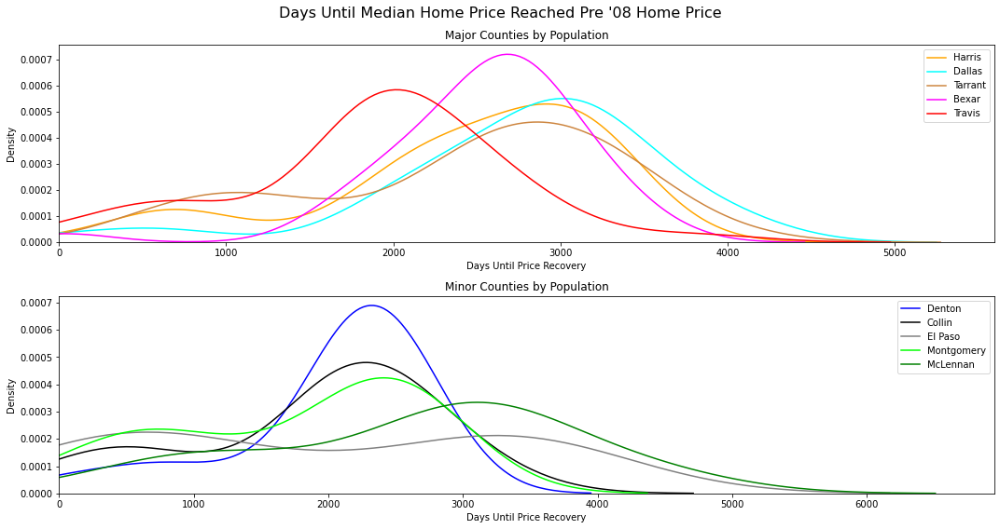

# Business Case

 

An investment group would like to invest in single family homes in 5 unique zip codes. They have a desired hold period of 1 to 3 years. With low interest rates, they would like to lock in purchases in the immediate to near future. 

I have the breadth of the entire country but have decided to hone in on Texas due to its favorable tax code and robust in place and emerging industries. Texas boasts the largest oil and gas production in the US and head quarters for 24 Fortune 500 companies. Austin, and other major metros, are becoming popular landing spots for tech entrepreneurs as opposed to the Bay Area. 

Over the past 10 years, the Texas population has grown 16%, the 3rd largest of any state. The population rate continues to grow strongly with new migration from surrounding states. Austin has over 400 people moving to the city each day. With historically low housing supply after the 2008 housing crisis and an environment with tight labor supply and high commodity costs, transactions are happening at record speeds. Houses no longer sit on the market for months on end, it's a sellers market.

Rather than view Texas without borders, I decided to hone in the top 10 metros by population. I am looking for quality locations that have shown exemplary short term/medium term/long term growth. I also want locations that are resiliant to macroeconomic factors like the 2008 housing bust. 

The remainder of this noteboook will show my thought process for how I honed in on the top 5 zip codes in Texas. 

## ***2008 Housing Bubble Recovery Time***

> I am subdiving the metros into primary and secondary > markets. Primary markets tend to have higher valuations and more name recognition. Secondary markets have more favorable prices but still have high quality assets. 

> I recommend investing in a combination of primary and secondary markets for increased diversification. The primary markets have high lower cap rates so there is more interest rate risk exposure and vice versa

> Primary and secondary markets have strong demand for tenants. Exposure to both minimizes risk. Out of the 5 counties per subdivision, I will select the top 3 from each based on recovery time.

  

- **Travis:** Selected due to lowest mean/median
- Tarrant: Not selected due to high standard deviation
- **Bexar:** Selected due to moderate mean/median and lowest standard deviation
- **Harris:** Selected due to superior metrics to Dallas
- Dallas: Not selected
- **El Paso:** Selected due to lowest mean/median, however high standard deviation
- **Collin:** Selected due to low median and low standard deviation
- Montgomery: Not selected due to high standard deviation
- **Denton:** Selected due to similar median/mean as Montgomery but lower standard deviation
- McLennan: Not selected

-----

## ***Top Growth Prospects***
- Based on recovery time, will be further inspecting: Travis, Bexar, Harris, El Paso, Collin, and Denton county
- Looking for zip codes that have shown higher than average growth over the past 2 years, 5 years, and 10 years
- Due to a 1 to 3 year hold period, I am placing a greater emphasis on short term growth
- I have created a 'cumulative' score which models growth such that: 40% of score based on 2-year return, 35% of score based on 5-year return, and 25% of score based on 10-year return
    - Using this metric, I have an agnostic way to select the top 3 zip codes per county to further analyze

  

- Visualization showing the top 5 growth zip codes per county
- The colored lines are the 3 with the highest cumulative score (ordered: red, blue, green)
- The grey and black lines represent the 4th and 5th highest scores which will not be analyzed
- As displayed, 2 year growth is the most highly desired characteristic for the zip code

--------

# Step 5: SARIMA Modeling

## *Travis County*
- Located in Austin, Texas
- Population of 1,247,400

 

- Based on the downside risk, upside return, and mean predicted value, 78758 seems like the superior zip code
- While it's upside is not as high as 78744, it has a much more predictable return profile and has the highest predicted forecast
- 78721 has the worst metrics across the board
- **In Travis county, 78758 has the best prospects for near term growth**

----

## *Bexar County* 
- Located in San Antonio metro
- Population: 2,003,554

 

- Based on the downside risk, upside return, and mean predicted value, 78210 seems like the superior zip code
- It has the highest upside, the highest predictions
- 78212 has promising predictions but it does not have as much upside, however it does have a more predictable
range of values
- **In Bexar county, 78210 has the best prospects for near term growth**

-----

## *Harris County*
- Located in Houston metro
- Population: 4,698,619

 
    

- Based on the downside risk, upside return, and mean predicted value, 77092 seems like the superior zip code
- It has the second highest upside, the highest predicted mean
- 77021 has a lower predicted mean forecast and a tight spread meaning minimal potential upside
- 77043 has too large a standard deviation, more risk than 77092 with a lower predicted return
- **In Harris county, 77092 has the best prospects for near term growth**

-----

## *El Paso* 
- Located in El Paso metro
- Population: 681,000

 

- Based on the downside risk, upside return, and mean predicted value, 79903 seems like the superior zip code
- It has the second highest upside, highest predicted mean, and second lowest downside risk
- 79927 has a very similar risk return profile
- 79902 has more downside risk
- **In El Paso county, 79903 has the best prospects for near term growth**

-----

## *Collin County* 
- Located in Dallas-Fort Worth metro
- Population: 782,341

 

- Based on the downside risk, upside return, and mean predicted value, 75023 seems like the superior zip code
- It has the second highest upside, second highest predicted mean, and lowest downside risk
- 75069 has a similar risk profile but more downside risk
- 75075 is the least desirable 
- **In Collin county, 75023 has the best prospects for near term growth**

-----

## *Denton County* 
- Located in Dallas-Fort Worth metro
- Population: 662,614
    

 
    

- Based on the downside risk, upside return, and mean predicted value, 76201 seems like the superior zip code
- It has the highest upside, highest predicted mean, and lowest downside risk
- 75057 and 75006 are very similar
- **In Denton county, 76201 has the best prospects for near term growth**

--------

# **Intepretation**

- Observe current prices
- Analyze correlation between different zip codes subdivided by market type
- Use Annualized Rate of Return to determine which Zip Code will be eliminated

## *Where Prices Stand Today*

- **Primary Market**
    - 78758 (Travis - Austin)
    - 78210 (Bexar - San Antonio)
    - 77092 (Harris - Houston)
- **Secondary Market**
    
    - 79903 (El Paso - El Paso)
    - 75023 (Collin - DFW)
    - 76201 (Denton - DFW)

    

- Entry point for 78758, 75023, and 77092 are all fairly close
    - Facotring in standard deviation, a home in each zip code could be acquired for the same asking price
- 76201 is in the middle
- 78210 and 79903 are faily close
    - Facotring in standard deviation, a home in each zip code could be acquired for the same asking price

## *Correlation Amongst Various Zip Codes*

- **Primary Market**
    - 78758 (Travis - Austin)
    - 78210 (Bexar - San Antonio)
    - 77092 (Harris - Houston)
- **Secondary Market**
    
    - 79903 (El Paso - El Paso)
    - 75023 (Collin - DFW)
    - 76201 (Denton - DFW)

  

    

- Collin and Denton move very closely together which isn't surprising given they are both located in DFW
- Harris (Houston) and Travis (Austin) move very closely together
- Since one zip code needs to be eliminated, it makes the most sense to get rid of one from either of those pairs
- Going to tilt towards a primary or secondary market heavy portfolio
- Desirable to have uncorrelated zip codes because the portfolio will have more diversification
- Overall, there isn't a signficant correlation difference between primary and secondary markets

# **Implementation**

- Compare predictions of all 5 zip codes
- Determine optimal month to buy and sell homes for each zip code
- Analyze prejected return on \$500,000 investment beginning in May 2018

## *Top 5 Zip Code Forecasts*

 

- Most of the top 5 zip codes have a greater upward trend than the average Texas home
- 79903 has lower returns but is included to diversify accross metros

## *Determing Optimal Time to Buy Based on Seasonality*

 

- **78210:** Buy in April, sell in December
- **78758:** Buy in July, sell in November
- **77092:** Buy in July, sell in October
- **76201:** Buy in April, sell in January
- **75023:** Buy in April, sell in July

## *Projected Return* 

 

- Various returns based on different hold periods
- Holding until at least May makes a significant difference on overall return
    - Highest marginal return in Nov 2019 and Apr 2020
- \$500,000 invested in May 2018 has a project value of \$687,000 in May 2020
    - 1 year hold - 15% return (15% Annualized RoR)
    - 2 year hold - 37% return (18.5% Annualized RoR)

> **Final Recommendation:** Invest $100,000 in equity across 78210, 78758, 77092, 76201, 75023 in their respective 'dip' months and hold for at least two years with intetention to sell in their 'peak' months. 

For more details please see the following [Jupyter Notebook](https://github.com/kuninethan95/Time_Series_Model/blob/main/Texas_zip_code_analysis.ipynb) or email kunin.ethan95@gmail.com