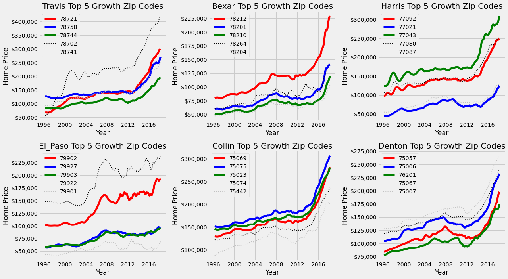
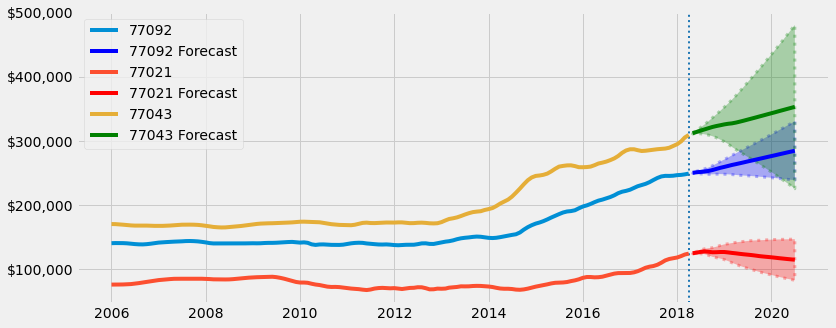

# Business Case


An investment group has tasked me with finding 5 candidate zip codes that they would like to invest in single family houses in. They have a desired hold period of 1 to 3 years and then would like to sell. With low interest rates, they would like to lock in purchases in the immediate to near future. 

I have the breadth of the entire country but have decided to hone in on Texas due to its favorable tax code and robust in place industries and emerging industries. Texas boasts the largest oil and gas production in the US and has many other Fortune 500 companies. Austin, and other major metros, are becoming popular for tech entrepreneurs as opposed to the Bay Area. 

Over the past 10 years, Texas has grown the 3rd largest in terms of population of any state, at 16%. The population rate continues to grow strongly with new migration from surrounding states. Austin has over 400 people moving to the city each day. With historically low housing supply after the 2008 housing crisis and an environment with tight labor supply and high commodity costs, transactions are happening at record speeds. Houses no longer sit on the market for months on end, it's a sellers market.

Rather than view Texas without borders, I decided to hone in the top 10 metros by population. I am looking for quality locations that have shown exemplary short term/medium term/long term growth. I also want locations that are resiliant to macroeconomic factors like the 2008 housing bust. 

The remainder of this noteboook will show my thought process for how I honed in on the top 5 zip codes in Texas


# Business Exploration

I want to find counties that are the most resistant to marcoeconomic downturns. Ideally, the county has a strong economy and businesses that continue to grow in the face of a negative backdrop. 

I chose to analyze how the top 10 metros in Texas responded to the 2008 housing bust. I analyzed how long each counties' respective zip codes took to reach price levels before the housing crisis. The longer a zip code took to recover, the less resiliant I considered it to be to negative macroeconomic factors.

I judged recovery time based on the mean, median, and standard deviation for zip codes recovery time. It is is important to have quick recovery but is also important that the spread is tight so the investor does not got caught holding the home in the zip code that is usually quick to recover but can also be the slowest.

## 2008 Housing Bubble Recovery Time

I am subdiving the metros into primary and secondary markets. Primary markets tend to have higher valuations and more name recognition. Secondary markets have more favorable prices but still have high quality assets. 

I would like to invest in a combination of primary and secondary markets so I am more diversified. The primary markets have high lower cap rates so there is more interest rate risk exposure. The secondard markets have higher cap rates so there is more flexibility if interest rates rise.

Primary and secondary markets have strong demand for tenants. Exposure to both minimizes risk. Out of the 5 counties per subdivision, I will select the top 3 from each based on recovery time.


  


- **Travis:** Selected due to lowest mean/median
- Tarrant: Not selected due to high standard deviation
- **Bexar:** Selected due to moderate mean/median and lowest standard deviation
- **Harris:** Selected due to superior metrics to Dallas
- Dallas: Not selected
- **El Paso:** Selected due to lowest mean/median, however high standard deviation
- **Collin:** Selected due to low median and low standard deviation
- Montgomery: Not selected due to high standard deviation
- **Denton:** Selected due to similar median/mean as Montgomery but lower standard deviation
- McLennan: Not selected

-----

## Top Growth Prospects
- Based on recovery time further inspecting: Travis, Bexar, Harris, El Paso, Collin, and Denton county
- Looking for zip codes that have shown higher than average growth over the past 2 years, 5 years, and 10 years
- Due to a 1 to 3 year hold period, I am placing a greater emphasis on short term than long term growth prospects
- I have created a 'cumulative' score which models growth such that: 40% of score based on 2-year return, 35% of score based on 5-year return, and 25% of score based on 10-year return
    - Using this metric, I have an agnostic way to select the top 3 zip codes per county to further analyze


  


- Visualization showing the top 5 growth zip codes per county
- The colored lines are the 3 with the highest cumulative score (ordered: red, blue, green)
- The grey and black lines represent the 4th and 5th highest scores which will not be analyzed
- As displayed, 2 year growth is the most highly desired characteristic for the zip code


--------

# Step 5: SARIMA Modeling


## Travis County


 

    


- 78758 has the highest ending point with the tightest confidence interval
- 78721 has almost as high of upside potential as 78758 but it has a much greater standard devation and tends to curve downwards
- 78744 slopes upward and has a standard deviation between the two other zip codes


- Based on the downside risk, upside return, and mean predicted value, 78758 seems like the superior zip code
- While it's upside is not as high as 78744, it has a much more predictable return profile and has the highest predicted forecast
- 78721 has the worst metrics across the board
- **In Travis county, 78758 has the best prospects for near term growth**

## Bexar County 
- Located in San Antonio metro
- Population: 2,003,554

 


- 78212 has the highest ending point with the tightest confidence interval
- 78201 has almost as high of upside potential as 78210 and they are both relatively close
    - Curves downward at the end slightly
- 78210 follows a similar trajectory as 78201 but has a more upward slope towards the end of the predictions

## Harris County 
- Located in Houston metro
- Population: 4,698,619


 
    


- 77043 has the highest ending point but also has a very large confidence interval
- 77092 moves steadily upward and has an upwards slope but a much tigher range
    - Curves upward at the end slightly
- 77021 trends lower in many years and trends down towards the end in a tight confidence interval


## El Paso 
- Located in El Paso metro
- Population: 681,000

 

    


- 79902 has the highest ending point but also has a very large confidence interval
    - Slopes slightly downward
- 79927 & 79903 move very tightly together, especially for predictions
    - 79903 extends further because it has more training data
    - Both have very similar predictions


## Collin County 
- Located in Dallas-Fort Worth metro
- Population: 782,341


 


- 75069 has the highest ending point but also has a very large confidence interval
    - Has a lower splope than test data
- 75075 & 75023 move very tightly together, especially for predictions
    - Both have very similar predictions


```python
collin_perc_comparison = county_forecast_perc_comparison(roi_75069, 75069, roi_75075, 75075, roi_75023, 75023)
collin_perc_comparison
```


<div>
<style scoped>
    .dataframe tbody tr th:only-of-type {
        vertical-align: middle;
    }

    .dataframe tbody tr th {
        vertical-align: top;
    }

    .dataframe thead th {
        text-align: right;
    }
</style>
<table border="1" class="dataframe">
  <thead>
    <tr style="text-align: right;">
      <th></th>
      <th>Perc Change</th>
      <th>Val</th>
      <th>$ Diff</th>
    </tr>
  </thead>
  <tbody>
    <tr>
      <th>75069</th>
      <td>NaN</td>
      <td>NaN</td>
      <td>NaN</td>
    </tr>
    <tr>
      <th>75075</th>
      <td>NaN</td>
      <td>NaN</td>
      <td>NaN</td>
    </tr>
    <tr>
      <th>75023</th>
      <td>NaN</td>
      <td>NaN</td>
      <td>NaN</td>
    </tr>
  </tbody>
</table>
</div>


- Based on the downside risk, upside return, and mean predicted value, 75023 seems like the superior zip code
- It has the second highest upside, second highest predicted mean, and lowest downside risk
- 75069 has a similar risk profile but more downside risk
- 75075 is the least desirable 
- **In Collin county, 75023 has the best prospects for near term growth**

## Denton County
- Located in Dallas-Fort Worth metro
- Population: 662,614

### 75057: EDA and SARIMAX
- Lewisville, Texas
- 27 miles from downtown Dallas


```python
# Create 75057 dataframe

df_75057 = create_zip_data(Denton_dict_full, 75057)
```


```python
zip_eda(df_75057, 75075, 'Denton')
```


    (<Figure size 1368x504 with 3 Axes>,
                    value
     count     265.000000
     mean   116648.679245
     std     21164.212042
     min     84000.000000
     25%    105900.000000
     50%    114400.000000
     75%    122400.000000
     max    197800.000000)


    

    


- Upward trend unitl 2008 and then large decline unitl 2013
    - Median house price recovered in 2015, significant dip between those years
- Data is right skewed as mean is greater than the median
- Based on the shape, prices have continuously trended upwards because of the right skew
- Spreads have been increasing from 2015 onwards, relatively large in 2007 and 2008
    - Prior, narrow distribution


```python
train_75057, test_75057 = create_train_test_split(df_75057, 0.92)
train_75057.plot()
test_75057.plot();
```


    

    


- Baseline split of 0.90
- Readjusted to 0.92 to capture more trend


```python
seasonal_decomposition(train_75057, 'Denton', 75057)
```


    

    


```python
decomposition = seasonal_decompose(train_75057,model='Additive')
seasonal = decomposition.seasonal
seasonal.plot(figsize=(10,4), xlim=('2012-01-01', '2014-01-01'));
```


    

    


- There is an upward trend from until 2008 when there is a dip and recovery beginning in 2014
- Data is annually seasonal with peaks in months (May-Aug) and dips in spring (Sept-Dec)
- Seasonality appears constant
- Residuals begin increasing in 2012 but taper back to low levels
- Looks like data needs 1 degree of differencing on seasonality


```python
fig_75057, future_75057, forecast_df_75057, roi_75057 = model_predictions(train_75057, test_75057, df_75057, 75057, 'Denton')
```


    

    


    

    


    

    


```python
roi_75057
```


    {'Lower CI': [-0.09476981692371161, 90523.01830762884, -9476.981692371162],
     'Upper CI': [0.17048600838397718, 117048.60083839772, 17048.600838397717],
     'Forecast': [0.03831553119596971, 103831.55311959698, 3831.5531195969816]}


- Current predictions
    - Model undershoots predictions 
    - Confidence interval captures values unitl mid 2017 when test data slopes up and predictions slope downwards
- Future predictions
    - Titls slighlty upward
    - Has a lower slope than the test data
- An investment of \$100,000 today (05/01/2018) by 02/01/2020 would yield (ROI):
    - Conservative estimate: -9.5\% (-\$9,476)
    - Mean estimate: 3.8% (\$3,831)
    - Upper estimate: 17.0\% (+\$17,048)

### 75006: EDA and SARIMAX
- Carroltown, Texas
- 18 miles from downtown Dallas


```python
# Create 75006 dataframe

df_75006 = create_zip_data(Denton_dict_full, 75006)
```


```python
zip_eda(df_75006, 75006, 'Denton')
```


    (<Figure size 1368x504 with 3 Axes>,
                    value
     count     265.000000
     mean   140426.415094
     std     26290.420186
     min    104500.000000
     25%    126900.000000
     50%    136900.000000
     75%    146600.000000
     max    232200.000000)


    

    


- Upward trend unitl 2008 and then large decline unitl 2012
    - Median house price recovered in 2015, significant dip between those years
- Data is right skewed as mean is greater than the median
- Based on the shape, prices have continuously trended upwards because of the right skew
- Spread was largest in 2016
    - Prior, narrow distribution


```python
train_75006, test_75006 = create_train_test_split(df_75006, 0.91)
train_75006.plot()
test_75006.plot();
```


    

    


- Baseline split of 0.91
- Adjusted to 0.91 to capture more trend


```python
seasonal_decomposition(train_75006, 'Denton', 75006)
```


    

    


```python
decomposition = seasonal_decompose(train_75006, model='Additive')
seasonal = decomposition.seasonal
seasonal.plot(figsize=(10,4), xlim=('2012-01-01', '2014-01-01'));
```


    

    


- There is an upward trend from until 2008 when there is a dip and recovery beginning in 2012
- Data is annually seasonal with peaks in months (May-Aug) and dips in spring (Nov-Feb)
- Seasonality appears constant
- Residuals begin increasing in 2012 but taper back to low levels
- Looks like data needs 1 degree of differencing on seasonality


```python
fig_75006, future_75006, forecast_df_75006, roi_75006 = model_predictions(train_75006, test_75006, df_75006, 75006, 'Denton')
```


    

    


    

    


    

    


```python
roi_75006
```


    {'Lower CI': [-0.07082745962191238, 92917.25403780876, -7082.745962191242],
     'Upper CI': [0.18818875744123817, 118818.87574412383, 18818.875744123827],
     'Forecast': [0.05898410931867103, 105898.4109318671, 5898.410931867096]}


- Current predictions
    - Model undershoots predictions, and tilts upwards and then downwards 
    - Confidence interval follows trend but but does not capture test data
- Future predictions
    - Titls slighlty upward, then a less positive slope
    - Has a lower slope than the test data, more flat
- An investment of \$100,000 today (05/01/2018) by 04/01/2020 would yield (ROI):
    - Conservative estimate: -7.0\% (-\$7,082)
    - Mean estimate: 5.9% (\$5,898)
    - Upper estimate: 18.8\% (+\$18,818)

### 76201: EDA and SARIMAX
- Denton, Texas
- 40 miles from downtown Dallas


```python
# Create 76201 dataframe

df_76201 = create_zip_data(Denton_dict_full, 76201)
```


```python
zip_eda(df_76201, 76201, 'Denton')
```


    (<Figure size 1368x504 with 3 Axes>,
                    value
     count     265.000000
     mean   105165.283019
     std     20572.239736
     min     77100.000000
     25%     91500.000000
     50%    102700.000000
     75%    109400.000000
     max    174800.000000)


    

    


- Upward trend unitl 2006 and then large decline unitl 2008, took another dip and recoverd in 2013
    - Median house price recovered in 2014, significant dip between those years
- Data is right skewed as mean is greater than the median
- Based on the shape, prices have continuously trended upwards because of the right skew
- Spread was largest in 2016
    - Prior, narrow distribution


```python
train_76201, test_76201 = create_train_test_split(df_76201, 0.91)
train_76201.plot()
test_76201.plot()
```


    <AxesSubplot:xlabel='time'>


    

    


- Baseline split 0.90
- Adjusted to 0.91 to try and capture trend


```python
seasonal_decomposition(train_76201, 'Denton', 76201)
```


    

    


```python
decomposition = seasonal_decompose(train_75006, model='Additive')
seasonal = decomposition.seasonal
seasonal.plot(figsize=(10,4), xlim=('2012-01-01', '2014-01-01'));
```


    

    


- There is an upward trend from until 2006 when there is a dip in 2008 and recovery beginning in 2012
- Data is annually seasonal with peaks in months (May-Aug) and dips in spring (Nov-Feb)
- Seasonality appears constant
- Residuals are largest in 2010 and 2014
- Looks like data needs 1 degree of differencing on seasonality


```python
fig_76201, future_76201, forecast_df_76201, roi_76201 = model_predictions(train_76201, test_76201, df_76201, 76201, 'Denton')
```


    

    


    

    


    

    


```python
roi_76201
```


    {'Lower CI': [0.0614400367648268, 106144.0036764827, 6144.003676482695],
     'Upper CI': [0.32978963819650703, 132978.9638196507, 32978.9638196507],
     'Forecast': [0.19608102824695128, 119608.10282469515, 19608.102824695146]}


- Current predictions
    - Model undershoots predictions, and tilts upwards and then downwards 
    - Confidence interval follows trend but but does not capture test data
- Future predictions
    - Titls slighlty upward, then a less positive slope
    - Follows the same trend as the test data
- An investment of \$100,000 today (05/01/2018) by 04/01/2020 would yield (ROI):
    - Conservative estimate: 6.1\% (-\$6,144)
    - Mean estimate: 33.0% (\$32,978)
    - Upper estimate: 19.6\% (+\$19,608)

## Denton County Conclusion


```python
corr_check(df_75057, df_75006, df_76201, 75057, 75006, 76201)
```


<div>
<style scoped>
    .dataframe tbody tr th:only-of-type {
        vertical-align: middle;
    }

    .dataframe tbody tr th {
        vertical-align: top;
    }

    .dataframe thead th {
        text-align: right;
    }
</style>
<table border="1" class="dataframe">
  <thead>
    <tr style="text-align: right;">
      <th></th>
      <th>75057</th>
      <th>75006</th>
      <th>76201</th>
    </tr>
  </thead>
  <tbody>
    <tr>
      <th>75057</th>
      <td>1.000000</td>
      <td>0.983245</td>
      <td>0.957606</td>
    </tr>
    <tr>
      <th>75006</th>
      <td>0.983245</td>
      <td>1.000000</td>
      <td>0.979073</td>
    </tr>
    <tr>
      <th>76201</th>
      <td>0.957606</td>
      <td>0.979073</td>
      <td>1.000000</td>
    </tr>
  </tbody>
</table>
</div>


- 75057 moves more closely with 76201
- 75006 moves more closely with 75057, very thin margin
- 76201 moves more closely with 75006


```python
county_forecast_comparison(df_75057, 75057, forecast_df_75057, df_75006, 75006, forecast_df_75006,  df_76201, 76201, forecast_df_76201)
```


    

    


- 75006 has the highest ending point but also has a very large confidence interval
- 75057 & 76201 move very tightly together but have differing predictions
    - 76201 has a much more positive slope than 75057


```python
denton_perc_comparison = county_forecast_perc_comparison(roi_75057, 75057, roi_75006, 75006, roi_76201, 76201)
denton_perc_comparison
```


<div>
<style scoped>
    .dataframe tbody tr th:only-of-type {
        vertical-align: middle;
    }

    .dataframe tbody tr th {
        vertical-align: top;
    }

    .dataframe thead th {
        text-align: right;
    }
</style>
<table border="1" class="dataframe">
  <thead>
    <tr style="text-align: right;">
      <th></th>
      <th>Perc Change</th>
      <th>Val</th>
      <th>$ Diff</th>
    </tr>
  </thead>
  <tbody>
    <tr>
      <th>75057</th>
      <td>NaN</td>
      <td>NaN</td>
      <td>NaN</td>
    </tr>
    <tr>
      <th>75006</th>
      <td>NaN</td>
      <td>NaN</td>
      <td>NaN</td>
    </tr>
    <tr>
      <th>76201</th>
      <td>NaN</td>
      <td>NaN</td>
      <td>NaN</td>
    </tr>
  </tbody>
</table>
</div>


- Based on the downside risk, upside return, and mean predicted value, 76201 seems like the superior zip code
- It has the highest upside, highest predicted mean, and lowest downside risk
- 75057 and 75006 are very similar
- **In Denton county, 76201 has the best prospects for near term growth**

# Intepretation

- Observe current prices
- Analyze correlation between different zip codes subdivided by market type
- Use Annualized Rate of Return to determine which Zip Code will be eliminated

## Where Prices Stand Today

- **Primary Market**
    - 78758 (Travis - Austin)
    - 78210 (Bexar - San Antonio)
    - 77092 (Harris - Houston)
- **Secondary Market**
    
    - 79903 (El Paso - El Paso)
    - 75023 (Collin - DFW)
    - 76201 (Denton - DFW)


```python
# Combine all 6 zip codes into one DataFrame

df_all = pd.concat([df_78758, df_78210, df_77092, df_79903, df_75023, df_76201], axis=1)
df_all.columns = [78758, 78210, 77092, 79903, 75023, 76201]
```


```python
with plt.style.context('fivethirtyeight'):
    fig, ax = plt.subplots(figsize=(8,4))
    fmt = '${x:,.0f}'
    tick = mtick.StrMethodFormatter(fmt)
    ax.yaxis.set_major_formatter(tick)

    df_all.iloc[-1].plot(kind='bar', ax=ax, label='Median Price',rot=180);
    df_all.std().plot(kind='bar', ax=ax, color='red', label='Standard Deviation');
    ax.legend(handlelength=0.5, borderpad=0.1, labelspacing=.1, prop={'size':10}, loc=1)
    ax.set_xlabel('Zip code')
    ax.set_ylabel('Median Home Price')
    ax.set_title('Top 6 Zip Codes Median Home Price and Standard Deviation')
```


    

    


- Entry point for 78758, 75023, and 77092 are all fairly close
    - Facotring in standard deviation, a home in each zip code could be acquired for the same asking price
- 76201 is in the middle
- 78210 and 79903 are faily close
    - Facotring in standard deviation, a home in each zip code could be acquired for the same asking price

## Correlation Amongst Various Zip Codes

- **Primary Market**
    - 78758 (Travis - Austin)
    - 78210 (Bexar - San Antonio)
    - 77092 (Harris - Houston)
- **Secondary Market**
    
    - 79903 (El Paso - El Paso)
    - 75023 (Collin - DFW)
    - 76201 (Denton - DFW)


```python
# Divide DataFrame into primary and secondary markets

df_large_county = pd.concat([df_78758, df_78210, df_77092], axis=1)
df_large_county.columns = [78758, 78210, 77092]

df_small_county = pd.concat([df_79903, df_75023, df_76201], axis=1)
df_small_county.columns = [79903, 75023, 76201]
```


```python
with plt.style.context('fivethirtyeight'):
    fig, axes = plt.subplots(figsize=(15,4), ncols=3)
    
    sns.heatmap(df_large_county.corr(), cmap='Greens', annot=True,ax=axes[0], cbar=False)
    axes[0].set_title('Large ZC Correlation', fontsize=12);
    
    sns.heatmap(df_small_county.corr(), cmap='Blues', annot=True,ax=axes[1], cbar=False)
    axes[1].set_title('Small ZC Correlation', fontsize=12);
    
    sns.heatmap(test.corr(), cmap='Reds', annot=True,ax=axes[2], cbar=False)
    axes[2].set_title('All ZC Correlation', fontsize=12);
```


    ---------------------------------------------------------------------------

    NameError                                 Traceback (most recent call last)

    <ipython-input-205-885ad3a78656> in <module>
          8     axes[1].set_title('Small ZC Correlation', fontsize=12);
          9 
    ---> 10     sns.heatmap(test.corr(), cmap='Reds', annot=True,ax=axes[2], cbar=False)
         11     axes[2].set_title('All ZC Correlation', fontsize=12);


    NameError: name 'test' is not defined


    

    


- Collin and Denton move very closely together which isn't surprising given they are both located in DFW
- Harris (Houston) and Travis (Austin) move very closely together
- Since one zip code needs to be eliminated, it makes the most sense to get rid of one from either of those pairs
- Going to tilt towards a primary or secondary market heavy portfolio
- Desirable to have uncorrelated zip codes because the portfolio will have more diversification
- Overall, there isn't a signficant correlation difference between primary and secondary markets

## Compare Annualized Rate of Return


```python
# Use zip code lengths to determine Annualized Rate of Returns

zip_lengths = []
top_zips = [forecast_df_78210, forecast_df_78758, forecast_df_77092,
             forecast_df_79903, forecast_df_75023, forecast_df_76201]
for zip_ in top_zips:
    zip_lengths.append(len(zip_))
zip_lengths = pd.Series(zip_lengths)
zip_lengths
```


```python
# Create DataFrame of top zip codes including predictions and confidence intervals

perc_val = pd.concat([bexar_perc_comparison[-3:], travis_perc_comparison[:3], harris_perc_comparison[:3],
           el_paso_perc_comparison[-3:], collin_perc_comparison[-3:], denton_perc_comparison[-3:]])
```


```python
# Prepare Annualized RoR by only separating out percent change rows

perc_top_zips = perc_val.iloc[range(0,16,3)]
perc_change = perc_top_zips.index.to_list()
perc_change = [x[0:6] for x in perc_change]
perc_top_zips.index = perc_change
perc_top_zips.reset_index(inplace=True)
apy = pd.concat([perc_top_zips,zip_lengths], axis=1)
apy.rename(columns={'index':'Zip'}, inplace=True)
apy.set_index('Zip', inplace=True)
apy.rename(columns={0:'Months'},inplace=True)

```

- **Primary Market**
    - 78758 (Travis - Austin)
    - 78210 (Bexar - San Antonio)
    - 77092 (Harris - Houston)
- **Secondary Market**
    
    - 79903 (El Paso - El Paso)
    - 75023 (Collin - DFW)
    - 76201 (Denton - DFW)


```python
# https://smartasset.com/retirement/roi-return-on-investment
# Annualized RoR formula

apy['Annualized_RoR'] = ((apy['Forecast']+1)**(1/(apy['Months']/12))-1)*100
apy.sort_values(by='Annualized_RoR', ascending=False)
```

- Primay Market Order: 78210, 78758, 77092
- Secondary Market Order: 76201, 75023, 79903

Due to disparity between Annualized Rate of Return and preferred tilt towards quality market, will be selecting **77092 over 79903**

# Implementation

- Compare predictions of all 5 zip codes
- Determine optimal month to buy and sell homes for each zip code
- Analyze prejected return on \$500,000 investment beginning in May 2018

## Top 5 Zip Code Forecasts


```python
with plt.style.context('ggplot'):

    fig, ax = plt.subplots(figsize=(12,6))
    
    fmt = '${x:,.0f}'
    tick = mtick.StrMethodFormatter(fmt)
    ax.yaxis.set_major_formatter(tick)
    
    texas_avg = df_texas.groupby('time').mean()
    texas_avg

    cols = df_all_5.columns.to_list()
    forecasts = [forecast_df_78758, forecast_df_78210, forecast_df_77092, forecast_df_79903, forecast_df_76201]

    for col, forecast in zip(cols, forecasts):
        ax.plot(df_all_5[col], label=col)
        ax.plot(forecast['Forecast'])
        ax.fill_between(forecast.index, forecast['Lower CI'], forecast['Upper CI'], alpha=0.3)
        ax.axvline(forecast.index[0], ls=':')

    ax.plot(texas_avg['value'], color='k', label='Avg Texas Home Price', lw=3)
    ax.set_xlabel('Time (years)')
    ax.set_ylabel('Home Price ($)')
    fig.suptitle('Annual Return of Top 5 Zip Codes Compared to Avg. Texas Median Home')
    ax.legend()
```

- Most of the top 5 zip codes have a greater upward trend than the average Texas home
- 79903 has lower returns but is included to diversify accross metros

## Determing Optimal Time to Buy Based on Seasonality


```python
with plt.style.context('fivethirtyeight'):
    fig, axes = plt.subplots(figsize=(20,13), nrows=2, ncols=3)
    training_models = [train_78210, train_78758, train_77092, train_76201, train_75023]
    zips_ = [78210, 78758, 77092, 76201, 75023]
    fig.suptitle('Seasonal Pricing Patterns', fontsize=40)

    for ax, train, zips_ in zip(axes.flatten(), training_models, zips_):
        decomposition = seasonal_decompose(train,model='Additive')
        seasonal = decomposition.seasonal
        seasonal.plot(xlim=('2014-01-01', '2016-01-01'), ax=ax)
        ax.set_title(zips_)
        ax.set_xlabel('')
        fig.tight_layout()
    fig.delaxes(axes[1,2]);
```

- **78210:** Buy in April, sell in December
- **78758:** Buy in July, sell in November
- **77092:** Buy in July, sell in October
- **76201:** Buy in April, sell in January
- **75023:** Buy in April, sell in July

## Projected Return


```python
top_zips_forecast = [forecast_df_78210['Forecast'], forecast_df_78758['Forecast'], forecast_df_77092['Forecast'],
            forecast_df_75023['Forecast'], forecast_df_76201['Forecast']]
```


```python
test = pd.concat(top_zips_forecast, axis=1)
```


```python
test.columns = [1,2,3,4,5]
test['mean']= test.mean(axis=1)
test.head(2)
```


```python
top_zips_upper = [forecast_df_78210['Upper CI'], forecast_df_78758['Upper CI'], forecast_df_77092['Upper CI'],
            forecast_df_75023['Upper CI'], forecast_df_76201['Upper CI']]
upper = pd.concat(top_zips_upper, axis=1)
upper['mean']= upper.mean(axis=1)
upper.head(2)
```


```python
top_zips_lower = [forecast_df_78210['Lower CI'], forecast_df_78758['Lower CI'], forecast_df_77092['Lower CI'],
            forecast_df_75023['Lower CI'], forecast_df_76201['Lower CI']]
lower = pd.concat(top_zips_lower, axis=1)
lower['mean']= lower.mean(axis=1)
lower.head(2)
```


```python
top_5_ci = pd.concat([test['mean'], upper['mean'], lower['mean']], axis=1)
top_5_ci.columns = ['mean', 'upper', 'lower']
top_5_ci['mean_pct'] = top_5_ci['mean'].pct_change(1)
500000/220653
len(top_5_ci)
```


```python
mean_mult = 500000/220653
upper_mult = 500000/221243
lower_mult = 500000/220063
top_5_ci['500_mean'] = top_5_ci['mean']*2.266001368664827
top_5_ci['500_lower'] = top_5_ci['lower']*lower_mult
top_5_ci['500_upper'] = top_5_ci['upper']*upper_mult
top_5_ci
```


```python
scatter = top_5_ci.iloc[range(0,27, 6)]
scatter
```


```python
import matplotlib.dates as mdates
import datetime as dt


with plt.style.context('fivethirtyeight'):
    fig, ax = plt.subplots(figsize=(12,5))
    fmt = '${x:,.0f}'
    tick = mtick.StrMethodFormatter(fmt)
    ax.yaxis.set_major_formatter(tick)
    
    ax.plot(top_5_ci['500_mean'])
    ax.scatter(x=scatter.index[1:], y=scatter.iloc[1:]['500_mean'], s=300)
    ax.fill_between(top_5_ci.index, top_5_ci['500_lower'], top_5_ci['500_upper'], alpha=0.2, color='blue')


    formatter = mdates.DateFormatter('%b %y')
    ax.xaxis.set_major_formatter(formatter)
    
    x = [dt.datetime(2018, 10, 25), dt.datetime(2019, 4, 25), 
         dt.datetime(2019, 11, 1), dt.datetime(2020, 5, 1)]
    y = [559792, 578227, 600257.611795, 713003]
    
#     ax.annotate('Mean Value: $222,165', (mdates.date2num(x[1]), y[1]), xytext=(15, 15), 
#             textcoords='offset points', arrowprops=dict(arrowstyle='-|>'))
#     ax.text(x=x[1], y=[1], s=)
    plt.text(x[0], y[0], '$519,792', size=16, ha='center', va='center', color='red', fontweight='bold')
    plt.text(x[1], y[1], '$550,227', size=16, ha='center', va='center', color='red', fontweight='bold')
    plt.text(x[2], y[2], '$568,947', size=16, ha='center', va='center', color='red', fontweight='bold')
    plt.text(x[3], y[3], '$687,003', size=16, ha='center', va='center', color='red', fontweight='bold')
    
    ax.axhline(500000, ls=':')
    
    ax.set_ylim(475000, 750000)
    ax.set_xlabel('Time (Months)')
    ax.set_ylabel('Median Home Price ($)')
    ax.set_title('Projected Returns ($500,000)')
    fig.tight_layout()
    
    
```

- Various returns based on different hold periods
- Holding until at least May makes a significant difference on overall return
    - Highest marginal return in Nov 2019 and Apr 2020
- \$500,000 invested in May 2018 has a project value of \\$687,000 in May 2020
    - 1 year hold - 15% return (15% Annualized RoR)
    - 2 year hold - 37% return (18.5% Annualized RoR)

# Testing Functions


```python

with plt.style.context('fivethirtyeight'):
    fig, ax = plt.subplots(figsize=(12,5))
    
    fmt = '${x:,.0f}'
    tick = mtick.StrMethodFormatter(fmt)
    ax.yaxis.set_major_formatter(tick)
    # 78758
    ax.plot(df_78758['2006-01-01':], label='78758')
    ax.plot(forecast_df_78758['Forecast'], label='78758 Forecast')
    ax.fill_between(forecast_df.index,forecast_df_78758['Lower CI'], forecast_df_78758['Upper CI'], alpha=0.3,
                   color='green')
    ax.axvline(df_78758.index[-1], ls =':')

    #78721
    ax.plot(df_78721['2006-01-01':], label='78721')
    ax.plot(forecast_df_78721['Forecast'], label='78721 Forecast')
    ax.fill_between(forecast_df.index,forecast_df_78721['Lower CI'], forecast_df_78721['Upper CI'], alpha=0.3,
                   color='red')

    #78744
    ax.plot(df_78744['2006-01-01':], label='78744')
    ax.plot(forecast_df_78744['Forecast'], label='78744 Forecast')
    ax.fill_between(forecast_df.index,forecast_df_78744['Lower CI'], forecast_df_78744['Upper CI'], alpha=0.3,
                   color='blue')

    ax.legend(loc=2)
```


```python

```


```python

```


```python
summary, ARMA_order, seasonal_order=find_auto_order(train_78210)
summary
```


```python
seasonal_order
```


```python
model = SARIMAX(train_78210,order=(1, 2, 2), seasonal_order=(2, 2, 2, 12),
                        enforce_stationarity=False, enforce_invertibility=False,
                        freq='MS')

```


```python
res = model.fit(maxiter=200)
res.summary()
```


```python
fore78210 = res.get_forecast(steps=len(test_78210))
```


```python
# save forecasted mean and upper/lower ci as df
forecast_df = fore78210.conf_int()
forecast_df.columns = ['Lower CI','Upper CI']
forecast_df['Forecast'] = fore78210.predicted_mean
forecast_df
```


```python
train_78210.plot()
test_78210.plot()
forecast_df['Forecast'].plot()
```

Trying another gridsearch method


```python
import itertools
# Define the p, d and q parameters to take any value between 0 and 2
p = d = q = range(0,3)

# Generate all different combinations of p, q and q triplets
pdq = list(itertools.product(p,d,q))

# Generate all different combinations of seasonal p, q and q triplets (use 12 for frequency)
pdqs = [(x[0], x[1], x[2], 12) for x in list(itertools.product(p, d, q))]
```


```python
aic_scores = []
for comb in pdq:
    for combs in pdqs:
        try:
            mod = SARIMAX(train_78210, order=comb, seasonal_order=combs, enforce_invertibility=False, enforce_stationarity=False)
            output = mod.fit(maxiter=100)
            aic_scores.append([comb, combs, output.aic])
        except:
            contiue
aic_scores
```


```python
pd.DataFrame(aic_scores).sort_values(2)
```


```python
def SARIMAX_man_results(train_data, arma_order, seasonal_order):
    """
    Takes a training data and ARMA/Seasonal order and fits a SARIMAX model with specied order and fits
    different parameters and returns the best SARIMAX model based on AIC value
    Parameters:
    Train data, seasonal/arma order
    Returns:
    Dictionary with various iterations of parameters and their AIC score and dictionary with the best 
    parameters
    """
    grid_results = []
    grid_tests = []
    mle_regression=[True,False]
    concentrate_scale = [True, False]
    results_dict = {}
    best_params = {}

    for mle in mle_regression:
        for scale in concentrate_scale:
            model = SARIMAX(train_data,order=arma_order, seasonal_order=seasonal_order,
                        enforce_stationarity=False, enforce_invertibility=False,
                        mle_regression=mle, concentrate_scale=scale,freq='MS', k_trend=2)
            results = model.fit()
            score_ = results.aic

            grid_tests.append([mle, scale])
            grid_results.append(score_)
    df = pd.DataFrame(grid_tests, grid_results).sort_index()
    df = df.rename(columns={0: 'MLE_Regression', 1: 'Concentrate_Scale'})
    results_dict['grid_search'] = df
    diagnostics = results.plot_diagnostics(figsize=(8,8))
    results_dict['diag_summary'] = diagnostics

    best_params['arma_order'] = arma_order
    best_params['seasonal_order'] = seasonal_order
    best_params['MLE_Regression'] = seasonal_order
    best_params['Concentrate_Scale'] = seasonal_order


    return results_dict, best_params
```


```python
def SARIMAX_man_results(train_data, arma_order, seasonal_order):
    """
    Takes a training data and ARMA/Seasonal order and fits a SARIMAX model with specied order and fits
    different parameters and returns the best SARIMAX model based on AIC value
    Parameters:
    Train data, seasonal/arma order
    Returns:
    Dictionary with various iterations of parameters and their AIC score and dictionary with the best 
    parameters
    """
    grid_results = []
    grid_tests = []
    mle_regression=[True,False]
    concentrate_scale = [True, False]
    results_dict = {}
    best_params = {}

    for mle in mle_regression:
        for scale in concentrate_scale:
            model = SARIMAX(train_data,order=arma_order, seasonal_order=seasonal_order,
                        enforce_stationarity=False, enforce_invertibility=False,
                        mle_regression=mle, concentrate_scale=scale,freq='MS', k_trend=2)
            results = model.fit()
            score_ = results.aic

            grid_tests.append([mle, scale])
            grid_results.append(score_)
    df = pd.DataFrame(grid_tests, grid_results).sort_index()
    df = df.rename(columns={0: 'MLE_Regression', 1: 'Concentrate_Scale'})
    results_dict['grid_search'] = df
    diagnostics = results.plot_diagnostics(figsize=(8,8))
    results_dict['diag_summary'] = diagnostics

    best_params['arma_order'] = arma_order
    best_params['seasonal_order'] = seasonal_order
    best_params['MLE_Regression'] = seasonal_order
    best_params['Concentrate_Scale'] = seasonal_order


    return results_dict, best_params
```


```python
import matplotlib.ticker as mtick

def model_predictions(train_data, test_data, all_data, code, county):
    """
    Uses all helper functions to create diagnostic summary, forecast on test data, and future predictions
    Parameters:
    Training data, test data, all data, zip code, and county
    Returns:
    Plot showing diagnostics and forecasts. Dictinary with predictions in the future
    """
    summary, arma_order, seasonal_order = find_auto_order(train_data)
    best_params = SARIMAX_man_results(train_data, arma_order, seasonal_order)
    best_model = fit_final_model(train_data, arma_order, seasonal_order, 
                                 best_params['MLE_Regression'], best_params['Concentrate_Scale'])
    forecast_df=get_forecast(best_model, test_data)
    test_forecast_fig=plot_forecast(train_data, test_data, forecast_df, code, county)
    bestall_model=fitall_final_model(all_data, arma_order, seasonal_order, 
                        best_params['MLE_Regression'], best_params['Concentrate_Scale'])
    
    fig, forecast_dict, forecast_df=plot_future_forecast(bestall_model, test_data, train_data, code, county)
    roi_helper = roi_dict(forecast_df)
    return fig, forecast_dict, forecast_df, roi_helper
```


```python
bexar_perc_comparison = county_forecast_perc_comparison(roi_77092, 77092, roi_77021, 77021, roi_77043, 77043)
bexar_perc_comparison
```


```python
# def plot_top3_5(all_perc_change_dict, county_dict_full, region):
    
#     top_5=list(all_perc_change_dict[region].index)[:5] 
#     with plt.style.context('fivethirtyeight'):
#         fig, ax = plt.subplots(figsize=(12,5))
#         ax.plot(county_dict_full[top_5[0]]['value'], color='red', label=top_5[0], lw=5)
#         ax.plot(county_dict_full[top_5[1]]['value'], color='blue', label=top_5[1], lw=5)
#         ax.plot(county_dict_full[top_5[2]]['value'], color='green', label=top_5[2], lw=5)
#         ax.plot(county_dict_full[top_5[3]]['value'], color='black', label=top_5[3], lw=2, ls=':')
#         ax.plot(county_dict_full[top_5[4]]['value'], color='silver', label=top_5[4], lw=2, ls=':')
#         ax.set_title(f"{region} Top 5 Growth Zip Codes")
#         ax.set_ylabel('Home Price')
#         ax.set_xlabel('Year')
#         ax.legend()
#         return fig 
```

# Appendix
- FB Prophet


```python

```
