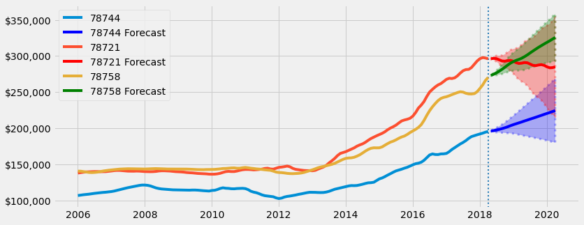

# Business Case


An investment group has tasked me with finding 5 candidate zip codes that they would like to invest in single family houses in. They have a desired hold period of 1 to 3 years and then would like to sell. With low interest rates, they would like to lock in purchases in the immediate to near future. 

I have the breadth of the entire country but have decided to hone in on Texas due to its favorable tax code and robust in place industries and emerging industries. Texas boasts the largest oil and gas production in the US and has many other Fortune 500 companies. Austin, and other major metros, are becoming popular for tech entrepreneurs as opposed to the Bay Area. 

Over the past 10 years, Texas has grown the 3rd largest in terms of population of any state, at 16%. The population rate continues to grow strongly with new migration from surrounding states. Austin has over 400 people moving to the city each day. With historically low housing supply after the 2008 housing crisis and an environment with tight labor supply and high commodity costs, transactions are happening at record speeds. Houses no longer sit on the market for months on end, it's a sellers market.

Rather than view Texas without borders, I decided to hone in the top 10 metros by population. I am looking for quality locations that have shown exemplary short term/medium term/long term growth. I also want locations that are resiliant to macroeconomic factors like the 2008 housing bust. 

The remainder of this noteboook will show my thought process for how I honed in on the top 5 zip codes in Texas


# Business Exploration

I want to find counties that are the most resistant to marcoeconomic downturns. Ideally, the county has a strong economy and businesses that continue to grow in the face of a negative backdrop. 

I chose to analyze how the top 10 metros in Texas responded to the 2008 housing bust. I analyzed how long each counties' respective zip codes took to reach price levels before the housing crisis. The longer a zip code took to recover, the less resiliant I considered it to be to negative macroeconomic factors.

I judged recovery time based on the mean, median, and standard deviation for zip codes recovery time. It is is important to have quick recovery but is also important that the spread is tight so the investor does not got caught holding the home in the zip code that is usually quick to recover but can also be the slowest.

## 2008 Housing Bubble Recovery Time

I am subdiving the metros into primary and secondary markets. Primary markets tend to have higher valuations and more name recognition. Secondary markets have more favorable prices but still have high quality assets. 

I would like to invest in a combination of primary and secondary markets so I am more diversified. The primary markets have high lower cap rates so there is more interest rate risk exposure. The secondard markets have higher cap rates so there is more flexibility if interest rates rise.

Primary and secondary markets have strong demand for tenants. Exposure to both minimizes risk. Out of the 5 counties per subdivision, I will select the top 3 from each based on recovery time.


  


- **Travis:** Selected due to lowest mean/median
- Tarrant: Not selected due to high standard deviation
- **Bexar:** Selected due to moderate mean/median and lowest standard deviation
- **Harris:** Selected due to superior metrics to Dallas
- Dallas: Not selected
- **El Paso:** Selected due to lowest mean/median, however high standard deviation
- **Collin:** Selected due to low median and low standard deviation
- Montgomery: Not selected due to high standard deviation
- **Denton:** Selected due to similar median/mean as Montgomery but lower standard deviation
- McLennan: Not selected

-----

## Top Growth Prospects
- Based on recovery time further inspecting: Travis, Bexar, Harris, El Paso, Collin, and Denton county
- Looking for zip codes that have shown higher than average growth over the past 2 years, 5 years, and 10 years
- Due to a 1 to 3 year hold period, I am placing a greater emphasis on short term than long term growth prospects
- I have created a 'cumulative' score which models growth such that: 40% of score based on 2-year return, 35% of score based on 5-year return, and 25% of score based on 10-year return
    - Using this metric, I have an agnostic way to select the top 3 zip codes per county to further analyze


  


- Visualization showing the top 5 growth zip codes per county
- The colored lines are the 3 with the highest cumulative score (ordered: red, blue, green)
- The grey and black lines represent the 4th and 5th highest scores which will not be analyzed
- As displayed, 2 year growth is the most highly desired characteristic for the zip code


--------

# Step 5: SARIMA Modeling


```python
def plot_forecast(train_data, test_data, prediction_table, code, county):
    """
    Plot forecasted predictions as opposed to test data
    ***Parameters:***
    Training data, test data, predictions, and zip code
    ***Returns:***
    Plot comparing predictions based off fitted model to test data
    """
    with plt.style.context('fivethirtyeight'):
        fig,ax = plt.subplots(figsize=(10,4))

        # Plotting Training and test data
        fmt = '${x:,.0f}'
        tick = mtick.StrMethodFormatter(fmt)
        ax.yaxis.set_major_formatter(tick) 
        train_data['2014-01-01':].plot(label='Training Data')
        test_data['2014-01-01':].plot(label='Test Data')

        ## Plotting Forefcast and CI
        prediction_table['Forecast'].plot(ax=ax,label='Forecast')
        ax.fill_between(prediction_table.index,
                        prediction_table['Lower CI'], 
                        prediction_table['Upper CI'],color='g',alpha=0.3)

        ax.set(ylabel=f'{code} Home Value')
        ax.legend()
        ax.set_title(f"{county} County - {code} Current Predictions")
        
        return fig;
```


```python
def fitall_final_model(df_all, arma_order, seasonal_order):
    """
    Fits final model on all data using specified parameters
    ***Parameters:***
    Zip code dataframe, final model best parameters
    ***Returns:***
    Best fit model on all data
    """
    model = SARIMAX(df_all,order=arma_order,seasonal_order=seasonal_order, enforce_invertibility=False, 
                    enforce_stationarity=False, freq='MS')
    bestall_model = model.fit()
    return bestall_model
```


```python
# Rerun on entire dataset to get further forecasts
import matplotlib.ticker as mtick

def plot_future_forecast(final_model, test_data, train_data, code, county):
    """
    Plot showing traing data, test data, and future predictions out to July 1st 2020
    ***Parameters:***
    Final model, test data, training data, zip code, and county
    ***Returns:***
    Plot showing training, test, and future values. Dictionary of final value low, high, and mean
    confidicene interval. Dataframe showing all future predictions
    """
    with plt.style.context('fivethirtyeight'):
    
        ## Get forecast
        forecast = final_model.get_forecast(steps=len(test_data))

        ## save forecasted mean and upper/lower ci as df
        forecast_dict={}
        forecast_df = forecast.conf_int()
        forecast_df.columns = ['Lower CI','Upper CI']
        forecast_df['Forecast'] = forecast.predicted_mean
        forecast_dict['low'] = forecast_df.iloc[-1]['Lower CI']
        forecast_dict['high'] = forecast_df.iloc[-1]['Upper CI']
        forecast_dict['mean'] = forecast_df.iloc[-1]['Forecast']

        ## Plot
        last_n_lags=52

        fig,ax = plt.subplots(figsize=(10,4))


        # Plotting Training and test data
        fmt = '${x:,.0f}'
        tick = mtick.StrMethodFormatter(fmt)
        ax.yaxis.set_major_formatter(tick) 
        ax.plot(train_data['2012-01-01':], label='Training Data')
        ax.plot(test_data['2012-01-01':], label='Test Data')
        ax.axvline(train_data.index[-1],ls=':')
        ax.set_xlabel('Year')
        ax.set_ylabel('Home Value')
        ax.set_title(f"{county} County - {code} Future Predictions")
        

        ## Plotting Forefcast and CI
        ax.plot(forecast_df['Forecast'], label='Forecast')
        ax.fill_between(forecast_df.index,
                        forecast_df['Lower CI'], 
                        forecast_df['Upper CI'],color='g',alpha=0.3)
        ax.legend(loc=2)
        return fig, forecast_dict, forecast_df
```


```python
def roi_dict(forecast_df):
    """
    Dictionary that shows percent change from end of dataset to forecasted date, along with value after
    initial $100,000 investment and the dollar difference between principal investment and future date
    ***Parameters:***
    DataFrame of forecasted predictions
    ***Returns:***
    Dictionary with returns on the upper/lower/and mean range
    """
    forecast_dict = {}
    cols = ['Lower CI', 'Upper CI', 'Forecast']
    for col in cols:
        perc_change=(forecast_df[col][-1]-forecast_df[col][0])/forecast_df[col][0]
        dollar_val=(perc_change+1)*100000
        dollar_dif = dollar_val-100000
        forecast_dict[col]=[]
        forecast_dict[col].append(perc_change)
        forecast_dict[col].append(dollar_val)
        forecast_dict[col].append(dollar_dif)
    return forecast_dict
```


```python
# Bring in ticker formats
import matplotlib.ticker as mtick

def model_predictions(train_data, test_data, all_data, code, county):
    """
    Uses all helper functions to create diagnostic summary, forecast on test data, and future predictions
    Parameters:
    Training data, test data, all data, zip code, and county
    Returns:
    Plot showing diagnostics and forecasts. Dictinary with predictions in the future
    """
    summary, arma_order, seasonal_order = find_auto_order(train_data)
#     best_params = SARIMAX_man_results(train_data, arma_order, seasonal_order)
    best_model = fit_final_model(train_data, arma_order, seasonal_order)
    forecast_df=get_forecast(best_model, test_data)
    test_forecast_fig=plot_forecast(train_data, test_data, forecast_df, code, county)
    bestall_model=fitall_final_model(all_data, arma_order, seasonal_order)
    
    fig, forecast_dict, forecast_df=plot_future_forecast(bestall_model, test_data, train_data, code, county)
    roi_helper = roi_dict(forecast_df)
    return fig, forecast_dict, forecast_df, roi_helper
```

## Travis County Modeling

- Capitol of Texas
- Located in Austin Metro
- Population: 1,273,954
- Median home value of $270,400 as of April 2018

### 78758: EDA and SARIMAX
- North Austin
- 4 miles from downtown Austin


```python
def create_zip_data (dict_full, zip_):
    """
    Takes a county dictionary and returns dataframe with values for specified zip code
    Parameters:
    Dictionary and zip code
    Returns:
    DataFrame which shows value and frequency is corrected to monthly data
    """
    df = dict_full[zip_].copy()
    df.drop(columns='RegionName', axis=1, inplace=True)
    df=df.resample('MS').asfreq()
    return df
```


```python
df_78758=create_zip_data(travis_dict_full, 78758)
```


```python
def zip_eda(df_full, code, county):
    """
    Takes a zip code and returns historic prices, price distributions, and series of boxplots where each
    box represents a year of data to better assess spread of prices
    Parameters:
    DataFrame, zip code, and county
    Returns:
    Summary figure and descriptive statistics per zip code
    """

    from matplotlib.gridspec import GridSpec
    with plt.style.context('bmh'):
        
        fig = plt.figure(figsize=(19, 7), constrained_layout=False)
        gs = GridSpec(nrows=2, ncols=2)
        # First axes
        
        ax0 = fig.add_subplot(gs[0, 0])
        fmt = '${x:,.0f}'
        tick = mtick.StrMethodFormatter(fmt)
        ax0.yaxis.set_major_formatter(tick) 
        ax0.plot(df_full['value'], color='r')
        ax0.set_title(f'{code} Price History')
        ax0.set_xlabel('Year')
        ax0.set_ylabel('Home Price')
        ax0.axvline(x='2000-01-01', label='Dotcom Boom', ls=':')
        ax0.axvline(x='2008-01-01', label='Housing Boom', ls=':', color='k')
        ax0.legend()
        # Second axes
        ax1 = fig.add_subplot(gs[1, 0])
        ax1.xaxis.set_major_formatter(tick) 
        sns.kdeplot(df_full['value'], ax=ax1, color='r')
        ax1.set_title(f'{code} Price Distribution')
        ax1.set_xlabel('Home Price')

        mean=df_full['value'].mean()
        median=df_full['value'].median()
        ax1.axvline(x=mean, label=f"Mean: ${round(mean,2)}", ls=':', color='blue')
        ax1.axvline(x=median, label=f"Median: ${round(median,2)}", ls=':', color='k')
        ax1.legend()
        # Third axes

        groups = df_full['1997-01-01':'2017-12-12'].groupby(pd.Grouper(freq='A'))
        df_annual=pd.DataFrame()
        for name, group in groups:
            df_annual[name.year]=group.values.ravel()
        ax2 = fig.add_subplot(gs[:, 1])
        ax2.yaxis.set_major_formatter(tick) 
        sns.boxplot(data=df_annual, ax=ax2)
        xticklabels = (range(1997,2018))
        ax2.set_xlabel('Year')
        ax2.set_xticklabels(xticklabels, rotation = 45, ha="right")
        ax2.set_title('Yearly Distribution of Median Home Prices')

        fig.suptitle(f'{county} County - {code}', fontsize=20)
        fig.tight_layout();
        res = df_full.describe()
        return fig, res;  
```


```python
zip_eda(df_78758, 78758, 'Travis')
```


    (<Figure size 1368x504 with 3 Axes>,
                    value
     count     265.000000
     mean   149549.056604
     std     34194.863952
     min    119000.000000
     25%    131900.000000
     50%    139900.000000
     75%    145000.000000
     max    270400.000000)


    

    


- Minimal impact on prices during dotcom crash and housing bust
- Data is right skewed based on mean > median
- From 1997 to 2012 homes have minimal spread but begin to increase after that with significantly larger spread in 2016


```python
# Plot data to determine accurate split point

df_78758.plot()
```


    <AxesSubplot:xlabel='time'>


    

    


```python
# int acts like floor division 

def create_train_test_split(df_full, split):
    """
    Takes a DataFrame and split value and divides data into train/test based on percentage allocated
    to training
    Parameters:
    DataFrame and split value
    Returns:
    Train and test data with size specified by split value
    """
    total_rows=len(df_full)
    train = df_full.iloc[:int(total_rows*split)]['value']
    test = df_full.iloc[int(total_rows*split):]['value']
    return train, test
```


```python
train_78758, test_78758 = create_train_test_split(df_78758, 0.91)
train_78758.plot()
test_78758.plot()
```


    <AxesSubplot:xlabel='time'>


    

    


- Baseline split of 0.90
- Adjusted to 0.91 to account for trend


```python
# Create diagnostic helper function
# Add .diff() to PACF/ACF dropna()

from statsmodels.graphics.tsaplots import plot_pacf, plot_acf
from matplotlib.gridspec import GridSpec
from statsmodels.tsa.stattools import adfuller

def pacf_acf_rolling(train, county, zip_, lags=30):
    with plt.style.context('bmh'):
    
        train=train.to_frame()
        fig = plt.figure(figsize=(19, 7), constrained_layout=False)
        gs = GridSpec(nrows=2, ncols=2)
        lags=30
        
        # First axes
        ax0 = fig.add_subplot(gs[0, 0])
        plot_acf(train['value'],lags=lags, ax=ax0);
        ax0.set_title('ACF Plot')

        # Second axes
        ax1 = fig.add_subplot(gs[1, 0])    
        plot_pacf(train['value'],lags=lags, ax=ax1)
        ax1.set_title('PACF Plot')


        # Third axes
        ax2 = fig.add_subplot(gs[:, 1])   
        
        train['12-month-SMA'] = train['value'].rolling(window=12).mean()
        train['12-month-Std'] = train['value'].rolling(window=12).std()
        ax2.plot(train['value'], label='Original Price')
        ax2.plot(train['12-month-SMA'], label='12-month-SMA')
        ax2.plot(train['12-month-Std'], label='12-month-Std')
        ax2.set_title('Rolling Window with Price')
        ax2.legend()

        fig.suptitle(f'{county} County - {zip_}', fontsize=20)
        fig.tight_layout();
        
        # Dickey Fuller
        print('Augmented Dickey-Fuller Test on 78722')
        dftest = adfuller(train['value'])
        dfout = pd.Series(dftest[0:4],index=['ADF test statistic','p-value','# lags used','# observations'])
        for key,val in dftest[4].items():
            dfout[f'critical value ({key})']=val
        print(dfout)
```


```python
pacf_acf_rolling(train_78758, 'Travis', 78758)
```

    Augmented Dickey-Fuller Test on 78722
    ADF test statistic        2.205379
    p-value                   0.998887
    # lags used              14.000000
    # observations          226.000000
    critical value (1%)      -3.459620
    critical value (5%)      -2.874415
    critical value (10%)     -2.573632
    dtype: float64


    

    


- ACF plot suggests data is not stationary because it has a downward gradual slope
    - Significant correlation up to 15 lags 
- PACF plot drops off steeply after first lag suggesting little relationship to time
- Standard deviation picks up around 2013 and there is a clear upward trend at this time


```python
# Import and apply seasonal_decompose()
from statsmodels.tsa.seasonal import seasonal_decompose

def seasonal_decomposition(train, county, zip_, model_type='Additive'):
    # Gather the trend, seasonality, and residuals 
    train=train.to_frame()
    decomposition = seasonal_decompose(train['value'],model=model_type)
    trend = decomposition.trend
    seasonal = decomposition.seasonal
    residual = decomposition.resid

    # Plot gathered statistics
    with plt.style.context('fivethirtyeight'):
        
        plt.figure(figsize=(12,8))
        plt.subplot(411, title=f'{county} County - {zip_}')
        plt.plot(train['value'], label='Original', color='blue')
        plt.legend(loc='best')
        plt.subplot(412)
        plt.plot(trend, label='Trend', color='blue')
        plt.legend(loc='best')
        plt.subplot(413)
        plt.plot(seasonal,label='Seasonality', color='blue')
        plt.legend(loc='best')
        plt.subplot(414)
        plt.plot(residual, label='Residuals', color='blue')
        plt.legend(loc='best')
        plt.tight_layout()
```


```python
seasonal_decomposition(train_78758, 'Travis', 78758)
```


    

    


```python
decomposition = seasonal_decompose(train_78758,model='Additive')
seasonal = decomposition.seasonal
seasonal.plot(figsize=(10,4), xlim=('2014-01-01', '2016-01-01'));
```


    

    


- There is an upward trend beginning in 2013
- Data is seasonal wiht peaks in the summer months (June-Sept) and dips in the winter months
- Seasonality appears constant
- Residuals suggest more variance after the upward trend in 2013


```python
fig_78758, future_78758, forecast_df_78758, roi_78758 = model_predictions(train_78758, test_78758, df_78758, 78758, 'Travis')
```


    

    


    

    


    

    


```python
roi_78758
```


    {'Lower CI': [0.07520575524266447, 107520.57552426643, 7520.575524266431],
     'Upper CI': [0.30851281020908994, 130851.281020909, 30851.281020908995],
     'Forecast': [0.19213891296389998, 119213.89129639, 19213.891296389993]}


- Current predictions
    - Model captures general trend compared to test predictions
    - Confidence interal does a better job at capturing values after July 2017
- Future predictions
    - Model continues to follow general trend upward
    - Has a descent in mid-2019 and then continues upwards
- An investment of \$100,000 today (05/01/2018) by 04/01/2020 would yield (ROI):
    - Conservative estimate: 7.5\% (\$7,520)
    - Mean estimate: 19.2% (\$19,213)
    - Upper estimate: 30.9\% (\$30,851)

### 78721: EDA AND SARIMAX
- East Austin
- 5 miles from downtown Austin


```python
# Create 78721 dataframe

df_78721=create_zip_data(travis_dict_full, 78721)
```


```python
zip_eda(df_78721, 78721, 'Travis')
```


    (<Figure size 1368x504 with 3 Axes>,
                    value
     count     265.000000
     mean   143692.452830
     std     51937.036652
     min     67600.000000
     25%    118700.000000
     50%    138800.000000
     75%    144600.000000
     max    297800.000000)


    

    


- Minimal impact on prices during dotcom crash and housing bust
- No large downturn but prices were stagnant between 2008 and 2012 before rising again
- Data is right skewed based on mean > median
- Historically prices are close to North Austin (78758)
- From 1997 to 2012 homes have minimal spread but begin to increase after that with significantly larger spread in 2013 and 2016


```python
train_78721, test_78721 = create_train_test_split(df_78721, 0.91)
train_78721.plot()
test_78721.plot()
```


    <AxesSubplot:xlabel='time'>


    

    


Split point looks like it accurately captures upward trend after 2013


```python
pacf_acf_rolling(train_78721, 'Travis', 78721)
```

    Augmented Dickey-Fuller Test on 78722
    ADF test statistic        0.753836
    p-value                   0.990853
    # lags used               9.000000
    # observations          231.000000
    critical value (1%)      -3.458980
    critical value (5%)      -2.874135
    critical value (10%)     -2.573482
    dtype: float64


    

    


- Based on Dickey Fuller test result data is not stationary, 0.99 > 0.05
- ACF plot suggests data is not stationary because it has a downward gradual slope
    - Significant correlation up to 16 lags 
- PACF plot drops off steeply after first lag suggesting little relationship to time
- Standard deviation picks up around 2013 and there is a clear upward trend at this time
- 12 month rolling average follows original data closely


```python
seasonal_decomposition(train_78721, 'Travis', 78721)
```


    

    


```python
decomposition = seasonal_decompose(train_78721,model='Additive')
seasonal = decomposition.seasonal
seasonal.plot(figsize=(10,4), xlim=('2014-01-01', '2016-01-01'));
```


    

    


- There is an upward trend beginning in 2013
- Data is annually seasonal with peaks in months (Aug-Nov) and dips in (Feb-July)
- Seasonality appears constant
- Residuals suggest more variance after the upward trend in 2013, however they appear to borderline
homoskedastic
- Looks like data needs 1 degree of differencing on seasonality


```python
fig_78721, future_78721, forecast_df_78721, roi_78721 = model_predictions(train_78721, test_78721, df_78721, 78721, 'Travis')
```


    

    


    

    


    

    


```python
roi_78721
```


    {'Lower CI': [-0.2688608776766025, 73113.91223233975, -26886.087767660254],
     'Upper CI': [0.1911430110027367, 119114.30110027367, 19114.301100273675],
     'Forecast': [-0.03811420402484699, 96188.5795975153, -3811.4204024846986]}


- Current predictions
    - Model semi-captures general trend compared to test predictions
    - It tends to undershoot the test data
    - Confidence interal does a better job at capturing values after July 2017
- Future predictions
    - Model becomes more stagnant after 2018 and has a wide confidence interval
    - Slopes upward a bit in 2019
- An investment of \$100,000 today (05/01/2018) by 04/01/2020 would yield (ROI):
    - Conservative estimate: -26.9\% (-\$26,886)
    - Mean estimate: -3.8% (-\$3,811)
    - Upper estimate: 19.1\% (+\$19,114)

### 78744: EDA and SARIMAX
- South East Austin
- 6.5 miles from downtown Austin


```python
# Create 78744 dataframe

df_78744=create_zip_data(travis_dict_full, 78744)
```


```python
zip_eda(df_78744, 7874, 'Travis')
```


    (<Figure size 1368x504 with 3 Axes>,
                    value
     count     265.000000
     mean   112487.169811
     std     25161.294558
     min     82000.000000
     25%     99700.000000
     50%    107900.000000
     75%    116900.000000
     max    195500.000000)


    

    


- Minimal impact on prices during dotcom crash and but large downturn after 2008 with another dip in 2012
    - Looks like the median house price recovered in 2013
- Data is right skewed based on mean > median
- Lowest standard deviation in Travis County of those compared agasint
- From 1997 to 2006 homes had minimal spread but 2007 and 2008 had more variability, spread increased from 2015 onwards
    - Suggests transactions are taking place at a wider range of values


```python
train_78744, test_78744 = create_train_test_split(df_78744, 0.91)
train_78744.plot()
test_78744.plot()
```


    <AxesSubplot:xlabel='time'>


    

    


Split captures upwards trend and precedes slight dip in 2016


```python
seasonal_decomposition(train_78744, 'Travis', 78744)
```


    

    


```python
decomposition = seasonal_decompose(train_78744,model='Additive')
seasonal = decomposition.seasonal
seasonal.plot(figsize=(10,4), xlim=('2014-01-01', '2016-01-01'));
```


    

    


- There is an upward trend beginning in 2012
- Data is annually seasonal with peaks in months (Nov-Feb) and dips in summer (June-Sept)
- Seasonality appears constant
- Residuals suggest more variance in 2008 and a similar amount following that point in time
- Looks like data needs 1 degree of differencing on seasonality


```python
fig_78744, future_78744, forecast_df_78744, roi_78744 = model_predictions(train_78744, test_78744, df_78744, 78744, 'Travis')
```


    

    


    

    


    

    


```python
roi_78744
```


    {'Lower CI': [-0.0782107601600331, 92178.92398399669, -7821.07601600331],
     'Upper CI': [0.36463656856079163, 136463.65685607918, 36463.65685607918],
     'Forecast': [0.14404750671074446, 114404.75067107445, 14404.75067107445]}


- Current predictions
    - Model captures general trend compared to test predictions, all test values fall within CI
    - It tends to undershoot the test data, especially after 2017
    - As test data tapers off the model does capture that 
- Future predictions
    - Model follows trend of test data
    - Slopes upward a bit in mid - 2019
- An investment of \$100,000 today (05/01/2018) by 04/01/2020 would yield (ROI):
    - Conservative estimate: -7.8\% (-\$7,821)
    - Mean estimate: 14.4% (+\$14,404)
    - Upper estimate: 36.4\% (+\$36,463)

## Travis County Conclusions


```python
def corr_check(df1, df2, df3, zip_1, zip_2, zip_3):
    df = pd.concat([df1, df2, df3], axis=1)
    df.columns = [zip_1, zip_2, zip_3]
    return df.corr()
```


```python
corr_check(df_78758, df_78721, df_78744, 78758, 78721, 78744)
```


<div>
<style scoped>
    .dataframe tbody tr th:only-of-type {
        vertical-align: middle;
    }

    .dataframe tbody tr th {
        vertical-align: top;
    }

    .dataframe thead th {
        text-align: right;
    }
</style>
<table border="1" class="dataframe">
  <thead>
    <tr style="text-align: right;">
      <th></th>
      <th>78758</th>
      <th>78721</th>
      <th>78744</th>
    </tr>
  </thead>
  <tbody>
    <tr>
      <th>78758</th>
      <td>1.000000</td>
      <td>0.967931</td>
      <td>0.970744</td>
    </tr>
    <tr>
      <th>78721</th>
      <td>0.967931</td>
      <td>1.000000</td>
      <td>0.980363</td>
    </tr>
    <tr>
      <th>78744</th>
      <td>0.970744</td>
      <td>0.980363</td>
      <td>1.000000</td>
    </tr>
  </tbody>
</table>
</div>


- 78758 moves more closely with 78744
- 78721 moves more closely with 78744
- 78744 moves more closely with 78721

- This can be useful for picking up on trends using other nearby zip codes. They all move very closely together


```python
# mess around with colors

def county_forecast_comparison(df1_all, zip_1, forecast1, df2_all, zip_2, forecast2, df3_all, zip_3, forecast3):
    with plt.style.context('fivethirtyeight'):
        fig, ax = plt.subplots(figsize=(12,5))

        fmt = '${x:,.0f}'
        tick = mtick.StrMethodFormatter(fmt)
        ax.yaxis.set_major_formatter(tick)

        # Ax1
        ax.plot(df1_all['2006-01-01':], label=zip_1)
        ax.plot(forecast1['Forecast'], color='Blue',label=f'{zip_1} Forecast')
        ax.fill_between(forecast1.index,forecast1['Lower CI'], forecast1['Upper CI'], alpha=0.3,
                       color='Blue', ls=':', facecolor='blue', lw=3)
        ax.axvline(df1_all.index[-1], ls =':', lw=2)

        # Ax2
        ax.plot(df2_all['2006-01-01':], label=zip_2)
        ax.plot(forecast2['Forecast'], label=f'{zip_2} Forecast', color='red')
        ax.fill_between(forecast2.index,forecast2['Lower CI'], forecast2['Upper CI'], alpha=0.3,
                       color='red', ls=':', facecolor='red', lw=3)

        #7 Ax3
        ax.plot(df3_all['2006-01-01':], label=zip_3)
        ax.plot(forecast3['Forecast'], label=f'{zip_3} Forecast', color='green')
        ax.fill_between(forecast3.index,forecast3['Lower CI'], forecast3['Upper CI'], alpha=0.3,
                       color='green', ls=':', facecolor='green', lw=3)

        ax.legend(loc=2)
```


```python
def county_forecast_perc_comparison(roi1, zip_1, roi2, zip_2, roi3, zip_3):
    test_1 = pd.DataFrame(roi1, index=[f'{zip_1} Perc Change', 'Val', '$ Diff'])
    test_2 = pd.DataFrame(roi2, index=[f'{zip_2} Perc Change', 'Val', '$ Diff'])
    test_3 = pd.DataFrame(roi3, index=[f'{zip_3} Perc Change', 'Val', '$ Diff'])
    df = pd.concat([test_1, test_2, test_3], axis=0)
    return df
```


```python
county_forecast_comparison(df_78744, 78744, forecast_df_78744, df_78721, 78721, forecast_df_78721,  df_78758, 78758, forecast_df_78758)
```


    

    


- 78758 has the highest ending point with the tightest confidence interval
- 78721 has almost as high of upside potential as 78758 but it has a much greater standard devation and tends to curve downwards
- 78744 slopes upward and has a standard deviation between the two other zip codes


```python
# Zip codes are their own row
# Column would be percent change val/$ diff
# original that works

def county_forecast_perc_comparison(roi1, zip_1, roi2, zip_2, roi3, zip_3):
    test_1 = pd.DataFrame(roi1, index=[f'{zip_1} Perc Change', 'Val', '$ Diff'])
    test_2 = pd.DataFrame(roi2, index=[f'{zip_2} Perc Change', 'Val', '$ Diff'])
    test_3 = pd.DataFrame(roi3, index=[f'{zip_3} Perc Change', 'Val', '$ Diff'])
    df = pd.concat([test_1, test_2, test_3], axis=0)
    return df
```


```python
def county_forecast_perc_comparison(roi1, zip_1, roi2, zip_2, roi3, zip_3):
    test_1 = pd.DataFrame(roi1, columns=['Perc Change', 'Val', '$ Diff'], index=[zip_1])
    test_2 = pd.DataFrame(roi2, columns=['Perc Change', 'Val', '$ Diff'], index=[zip_2])
    test_3 = pd.DataFrame(roi3, columns=['Perc Change', 'Val', '$ Diff'], index=[zip_3])
    df = pd.concat([test_1, test_2, test_3], axis=0)
    return df
```


```python
travis_perc_comparison = county_forecast_perc_comparison(roi_78758, 78758, roi_78721, 78721, roi_78744, 78744)
```


```python
pd.DataFrame(roi_78721, index=['Perc Change', 'Val', '$ Diff']).T
```


<div>
<style scoped>
    .dataframe tbody tr th:only-of-type {
        vertical-align: middle;
    }

    .dataframe tbody tr th {
        vertical-align: top;
    }

    .dataframe thead th {
        text-align: right;
    }
</style>
<table border="1" class="dataframe">
  <thead>
    <tr style="text-align: right;">
      <th></th>
      <th>Perc Change</th>
      <th>Val</th>
      <th>$ Diff</th>
    </tr>
  </thead>
  <tbody>
    <tr>
      <th>Lower CI</th>
      <td>-0.268861</td>
      <td>73113.912232</td>
      <td>-26886.087768</td>
    </tr>
    <tr>
      <th>Upper CI</th>
      <td>0.191143</td>
      <td>119114.301100</td>
      <td>19114.301100</td>
    </tr>
    <tr>
      <th>Forecast</th>
      <td>-0.038114</td>
      <td>96188.579598</td>
      <td>-3811.420402</td>
    </tr>
  </tbody>
</table>
</div>


```python
# # Loop thru columns to 

# pd.DataFrame({78758:pd.Series(roi_78758)[0], 78721:pd.Series(roi_78721)[0]}).T.columns=
```


```python
travis_perc_comparison
```


<div>
<style scoped>
    .dataframe tbody tr th:only-of-type {
        vertical-align: middle;
    }

    .dataframe tbody tr th {
        vertical-align: top;
    }

    .dataframe thead th {
        text-align: right;
    }
</style>
<table border="1" class="dataframe">
  <thead>
    <tr style="text-align: right;">
      <th></th>
      <th>Perc Change</th>
      <th>Val</th>
      <th>$ Diff</th>
    </tr>
  </thead>
  <tbody>
    <tr>
      <th>78758</th>
      <td>NaN</td>
      <td>NaN</td>
      <td>NaN</td>
    </tr>
    <tr>
      <th>78721</th>
      <td>NaN</td>
      <td>NaN</td>
      <td>NaN</td>
    </tr>
    <tr>
      <th>78744</th>
      <td>NaN</td>
      <td>NaN</td>
      <td>NaN</td>
    </tr>
  </tbody>
</table>
</div>


- Based on the downside risk, upside return, and mean predicted value, 78758 seems like the superior zip code
- While it's upside is not as high as 78744, it has a much more predictable return profile and has the highest predicted forecast
- 78721 has the worst metrics across the board
- **In Travis county, 78758 has the best prospects for near term growth**

## Bexar County Modeling
- Located in San Antonio metro
- Population: 2,003,554

### 78212: EDA and SARIMAX
- Midtown San Antonio
- 4 miles from downtown San Antonio


```python
# Create 78212 dataframe

df_78212=create_zip_data(Bexar_dict_full, 78212)
```


```python
zip_eda(df_78212, 78212, 'Bexar')
```


    (<Figure size 1368x504 with 3 Axes>,
                    value
     count     265.000000
     mean   115321.509434
     std     31134.681006
     min     79100.000000
     25%     89900.000000
     50%    114600.000000
     75%    121900.000000
     max    229100.000000)


    

    


- Minimal impact on prices during dotcom crash and minimala downturn after 2008 with another dip in 2012 followed by strong recovery shortly after
    - Looks like the median house price recovered in 2013
- Data is slightly right skewed based on mean > median
- Data appears sort of bimodal suggesting there were swings when prices were much lower and now much higher, was not a continuous shift
- From 1997 to 2005 homes had minimal spread but 2006 had more variability, spread increased from 2015 onwards
    - Suggests transactions are taking place at a wider range of values throughout the year


```python
train_78212, test_78212 = create_train_test_split(df_78212, 0.93)
train_78212.plot()
test_78212.plot()
```


    <AxesSubplot:xlabel='time'>


    

    


- Split point detects recent upward (possibly exponential) trend
- Initially used 0.90 but it was not capturing the trend well so used 0.93 of the training data


```python
seasonal_decomposition(train_78212, 'Bexar', 78212)
```


    

    


```python
decomposition = seasonal_decompose(train_78212,model='Additive')
seasonal = decomposition.seasonal
seasonal.plot(figsize=(10,4), xlim=('2014-01-01', '2016-01-01'));
```


    

    


- There is an upward trend beginning in 2011
- Data is annually seasonal with peaks in months (Oct-Feb) and dips in summer (June-Sept)
- Seasonality appears constant
- Residuals suggest more variance in 2008 and a similar amount following that point in time
    - Lower variance beginning in 2014
- Looks like data needs 1 degree of differencing on seasonality


```python
fig_78212, future_78212, forecast_df_78212, roi_78212 = model_predictions(train_78212, test_78212, df_78212, 78212, 'Bexar')
```


    

    


    

    


    

    


```python
roi_78212
```


    {'Lower CI': [0.07944511492223134, 107944.51149222313, 7944.51149222313],
     'Upper CI': [0.27361853144748954, 127361.85314474895, 27361.85314474895],
     'Forecast': [0.17680210000466143, 117680.21000046613, 17680.210000466133]}


- Current predictions
    - Model captures general trend compared to test predictions, all test values fall within CI
    - The predictions look like they follow a rolling average of the model
- Future predictions
    - Model follows trend of test data
    - Slopes upward a bit in mid - 2019
- An investment of \$100,000 today (05/01/2018) by 11/01/2019 would yield (ROI):
    - Conservative estimate: 7.9\% (\$7,994)
    - Mean estimate: 17.7% (+\$17,680)
    - Upper estimate: 27.4\% (+\$27,361)

### 78201: EDA and SARIMAX
- Monticello Park, San Antonio
- 5.4 miles from downtown San Antonio


```python
# Create 78201 dataframe

df_78201=create_zip_data(Bexar_dict_full, 78201)
```


```python
zip_eda(df_78201, 78201, 'Bexar')
```


    (<Figure size 1368x504 with 3 Axes>,
                    value
     count     265.000000
     mean    78893.584906
     std     17210.957034
     min     59100.000000
     25%     64800.000000
     50%     78500.000000
     75%     84300.000000
     max    140600.000000)


    

    


- Small downward trend after dotcom boom with a rise up to 2008 and then a big fall
    - median house price recovered in 2015
- Data is slightly right skewed
- Data appears sort of bimodal suggesting there were swings when prices were much lower and now much higher, was not a continuous shift
- Not too much spread between home prices except for in 2006 and a very large spread in 2017


```python
train_78201, test_78201 = create_train_test_split(df_78201, 0.94)
train_78201.plot()
test_78201.plot()
```


    <AxesSubplot:xlabel='time'>


    

    


- Had to adjust split point from 0.90 to 0.94 because model was not able to capture new upward trend


```python
seasonal_decomposition(train_78201, 'Bexar', 78201)
```


    

    


```python
decomposition = seasonal_decompose(train_78201,model='Additive')
seasonal = decomposition.seasonal
seasonal.plot(figsize=(10,4), xlim=('2012-01-01', '2013-01-01'));
```


    

    


- There is an upward trend beginning in 2013
- Affected more by 2008 crash than other zip codes
- Data is annually seasonal with peaks in months (July-Oct) and dips in spring (Mar-May)
- Seasonality appears constant
- Residuals suggest more variance in 2008 and a similar amount following that point in time
    - Continuously increases
- Looks like data needs 1 degree of differencing on seasonality


```python
fig_78201, future_78201, forecast_df_78201, roi_78201 = model_predictions(train_78201, test_78201, df_78201, 78201, 'Bexar')
```


    

    


    

    


    

    


```python
roi_78201
```


    {'Lower CI': [-0.08668127170465845, 91331.87282953416, -8668.127170465843],
     'Upper CI': [0.13400088311669692, 113400.0883116697, 13400.088311669693],
     'Forecast': [0.024010324701326687, 102401.03247013266, 2401.032470132661]}


- Current predictions
    - Model captures general trend compared to test predictions, however it undershoots the test data
    - Same shape but shifted below by a constant value
- Future predictions
    - Stays stagnant after test data
- An investment of \$100,000 today (05/01/2018) by 08/01/2019 would yield (ROI):
    - Conservative estimate: -8.7\% (-\$8,668)
    - Mean estimate: 2.3% (+\$2,401)
    - Upper estimate: 13.4\% (+\$13,400)

### 78210: EDA and SARIMAX
- Highland Park, San Antonio
- 3 miles from Downtown San Antonio


```python
# Create 78210 dataframe

df_78210=create_zip_data(Bexar_dict_full, 78210)
```


```python
zip_eda(df_78210, 78210, 'Bexar')
```


    (<Figure size 1368x504 with 3 Axes>,
                    value
     count     265.000000
     mean    67078.867925
     std     12593.568233
     min     50500.000000
     25%     56600.000000
     50%     68400.000000
     75%     72200.000000
     max    119400.000000)


    

    


- Small downward trend after dotcom boom with a rise up to 2008 and then a big fall
    - Median house price recovered in 2015
- Data is slightly right skewed
- Data appears sort of bimodal suggesting there were swings when prices were much lower and now much 
higher, was not a continuous shift
    - There was a peak price around 2006 and then a new peak price reached in 2017
- Not too much spread between home prices except for in 2006 and a very large spread in 2017


```python
train_78210, test_78210 = create_train_test_split(df_78210, 0.93)
train_78210.plot()
test_78210.plot()
```


    <AxesSubplot:xlabel='time'>


    

    


- Original split at 0.90 but deviated to 0.93 to better capture trend


```python
seasonal_decomposition(train_78210, 'Bexar', 78210)
```


    

    


```python
decomposition = seasonal_decompose(train_78210,model='Additive')
seasonal = decomposition.seasonal
seasonal.plot(figsize=(10,4), xlim=('2012-01-01', '2013-01-01'));
```


    

    


- There is an upward trend beginning in 2013
- Big downward swing in trend in 2008 and 2002
- Data is annually seasonal with peaks in months (Oct-Jan) and dips in spring (Apr-June)
- Seasonality appears constant
- Residuals have the most variance in 2012
- Looks like data needs 1 degree of differencing on seasonality


```python
fig_78210, future_78210, forecast_df_78210, roi_78210 = model_predictions(train_78210, test_78210, df_78210, 78210, 'Bexar')
```


    

    


    

    


    

    


```python
roi_78210
```


    {'Lower CI': [0.09419980807344343, 109419.98080734434, 9419.980807344342],
     'Upper CI': [0.3700735265708664, 137007.35265708662, 37007.35265708662],
     'Forecast': [0.23263775992395297, 123263.77599239531, 23263.775992395313]}


- Current predictions
    - Model captures general trend poorly especially as the test values continue into 2018
    - The predictions shift downward which is the opposite of what truly occurs
- Future predictions
    - Continues upward with a slight downward bend in mid-2019
- An investment of \$100,000 today (05/01/2018) by 11/01/2019 would yield (ROI):
    - Conservative estimate: 9.4\% (\$9,419)
    - Mean estimate: 23.3% (+\$23,263)
    - Upper estimate: 37.0\% (+\$37,007)

## Bexar County Conclusion


```python
corr_check(df_78212, df_78201, df_78210, 78212, 78201, 78210)
```


<div>
<style scoped>
    .dataframe tbody tr th:only-of-type {
        vertical-align: middle;
    }

    .dataframe tbody tr th {
        vertical-align: top;
    }

    .dataframe thead th {
        text-align: right;
    }
</style>
<table border="1" class="dataframe">
  <thead>
    <tr style="text-align: right;">
      <th></th>
      <th>78212</th>
      <th>78201</th>
      <th>78210</th>
    </tr>
  </thead>
  <tbody>
    <tr>
      <th>78212</th>
      <td>1.000000</td>
      <td>0.985177</td>
      <td>0.962089</td>
    </tr>
    <tr>
      <th>78201</th>
      <td>0.985177</td>
      <td>1.000000</td>
      <td>0.984328</td>
    </tr>
    <tr>
      <th>78210</th>
      <td>0.962089</td>
      <td>0.984328</td>
      <td>1.000000</td>
    </tr>
  </tbody>
</table>
</div>


- 78212 moves more closely with 78201
- 78201 moves equally closely with 78212 and 78210
- 78210 moves more closely with 78701

- This can be useful for picking up on trends using other nearby zip codes. They all move very closely together


```python
county_forecast_comparison(df_78212, 78212, forecast_df_78212, df_78201, 78201, forecast_df_78201,  df_78210, 78210, forecast_df_78210)
```


    

    


- 78212 has the highest ending point with the tightest confidence interval
- 78201 has almost as high of upside potential as 78210 and they are both relatively close
    - Curves downward at the end slightly
- 78210 follows a similar trajectory as 78201 but has a more upward slope towards the end of the predictions


```python
bexar_perc_comparison = county_forecast_perc_comparison(roi_78212, 78212, roi_78201, 78201, roi_78210, 78210)
bexar_perc_comparison
```


<div>
<style scoped>
    .dataframe tbody tr th:only-of-type {
        vertical-align: middle;
    }

    .dataframe tbody tr th {
        vertical-align: top;
    }

    .dataframe thead th {
        text-align: right;
    }
</style>
<table border="1" class="dataframe">
  <thead>
    <tr style="text-align: right;">
      <th></th>
      <th>Perc Change</th>
      <th>Val</th>
      <th>$ Diff</th>
    </tr>
  </thead>
  <tbody>
    <tr>
      <th>78212</th>
      <td>NaN</td>
      <td>NaN</td>
      <td>NaN</td>
    </tr>
    <tr>
      <th>78201</th>
      <td>NaN</td>
      <td>NaN</td>
      <td>NaN</td>
    </tr>
    <tr>
      <th>78210</th>
      <td>NaN</td>
      <td>NaN</td>
      <td>NaN</td>
    </tr>
  </tbody>
</table>
</div>


- Based on the downside risk, upside return, and mean predicted value, 78210 seems like the superior zip code
- It has the highest upside, the highest predictions
- 78212 has promising predictions but it does not have as much upside, however it does have a more predictable
range of values
- **In Bexar county, 78210 has the best prospects for near term growth**

## Harris County Modeling
- Located in Houston metro
- Population: 4,698,619

### 77092: EDA and SARIMAX
- Fairbanks Houston
- 11.5 miles from downtown Houston


```python
# Create 78210 dataframe

df_77092=create_zip_data(Harris_dict_full, 77092)
```


```python
zip_eda(df_77092, 77092, 'Harris')
```


    (<Figure size 1368x504 with 3 Axes>,
                    value
     count     265.000000
     mean   144012.075472
     std     33847.416163
     min     95600.000000
     25%    124000.000000
     50%    139500.000000
     75%    143700.000000
     max    249300.000000)


    

    


- Small downward trend after dotcom boom with a rise up to 2008 and then a gradual leveling until an increase in 2014
    - Median house price recovered in 2014 but was not significant affected
- Data is slightly right skewed
- Based on the shape there are more homes that are more expensive than the average than less which reflects the recent upward trend the zip code has been experiencing
    - Prices have steadily risen
- Minimal spread between years unitl 2014 and then spread has gradually increased


```python
train_77092, test_77092 = create_train_test_split(df_77092, 0.90)
train_77092.plot()
test_77092.plot()
```


    <AxesSubplot:xlabel='time'>


    

    


Baseline split at 0.90


```python
seasonal_decomposition(train_77092, 'Harris', 77092)
```


    

    


```python
decomposition = seasonal_decompose(train_77092,model='Additive')
seasonal = decomposition.seasonal
seasonal.plot(figsize=(10,4), xlim=('2012-01-01', '2014-01-01'));
```


    

    


- There is an upward trend beginning in 2014
    - Prior, trend was stagnant
- Data is annually seasonal with peaks in months (Oct-Jan) and dips in spring (June-Aug)
- Seasonality appears constant
- Residuals have the most variance up to 2000 and past 2012
- Looks like data needs 1 degree of differencing on seasonality


```python
fig_77092, future_77092, forecast_df_77092, roi_77092 = model_predictions(train_77092, test_77092, df_77092, 77092, 'Harris')
```


    

    


    

    


    

    


```python
roi_77092
```


    {'Lower CI': [-0.04321599776274212, 95678.4002237258, -4321.5997762742045],
     'Upper CI': [0.31696593080350516, 131696.59308035052, 31696.593080350518],
     'Forecast': [0.13736790632659834, 113736.79063265985, 13736.790632659846]}


- Current predictions
    - Model captures general trend very well, stays tight with the real values
    - Slight noise in true values that the prediction does not pick up on
- Future predictions
    - Increases upward slope with a wide confidence interval
- An investment of \$100,000 today (05/01/2018) by 07/01/2020 would yield (ROI):
    - Conservative estimate: -4.3\% (-\$4,321)
    - Mean estimate: 13.7% (+\$13,736)
    - Upper estimate: 31.7\% (+\$31,696)

### 77021: EDA and SARIMAX
- South Houston
- 6.4 miles from downtown Houston


```python
# Create 782021 dataframe

df_77021=create_zip_data(Harris_dict_full, 77021)
```


```python
zip_eda(df_77021, 77021, 'Harris')
```


    (<Figure size 1368x504 with 3 Axes>,
                    value
     count     265.000000
     mean    72533.962264
     std     15263.205204
     min     44600.000000
     25%     61900.000000
     50%     71900.000000
     75%     81800.000000
     max    124700.000000)


    

    


- Small downward trend after dotcom boom with a rise up to 2008 and then a crash until 2015
    - Median house price recovered in 2016, pretty strongly affected
- Data is slightly right skewed
- Based on the shape there are more homes that are more expensive than the average than less which reflects the recent upward trend the zip code has been experiencing
    - Prices have steadily risen since 2016
- Minimal spread between years unitl 2008 and then spread has been increasing again since 2016


```python
train_77021, test_77021 = create_train_test_split(df_77021, 0.90)
train_77021.plot()
test_77021.plot()
```


    <AxesSubplot:xlabel='time'>


    

    


Baseline split point 0.90


```python
seasonal_decomposition(train_77021, 'Harris', 77021)
```


    

    


```python
decomposition = seasonal_decompose(train_77021,model='Additive')
seasonal = decomposition.seasonal
seasonal.plot(figsize=(10,4), xlim=('2012-01-01', '2014-01-01'));
```


    

    


- There is an upward trend from 2002 to 2009 and then it dips and begins to recover in 2013
- Data is annually seasonal with peaks in months (April-August) and dips in spring (Sept-Jan)
- Seasonality appears constant
- Residuals have the most variance between 2010 and 2016
- Looks like data needs 1 degree of differencing on seasonality


```python
fig_77021, future_77021, forecast_df_77021, roi_77021 = model_predictions(train_77021, test_77021, df_77021, 77021, 'Harris')
```


    

    


    

    


    

    


```python
roi_77021
```


    {'Lower CI': [-0.33226377476658764, 66773.62252334124, -33226.37747665876],
     'Upper CI': [0.16710466083824432, 116710.46608382443, 16710.46608382443],
     'Forecast': [-0.08097462904054722, 91902.53709594528, -8097.462904054715]}


- Current predictions
    - Model captures general trend very well in terms of confidence interval but skews down as test data goes up
- Future predictions
    - Deviates significant from the trend and tilts downward as the past data goes up
- An investment of \$100,000 today (05/01/2018) by 07/01/2020 would yield (ROI):
    - Conservative estimate: -33.2\% (-\$33,226)
    - Mean estimate: -8.0% (-\$8,097)
    - Upper estimate: 16.7\% (+\$16,710)

### 77043: EDA and SARIMAX
- Spring Branch Houston
- 15.6 miles from downtown Houston


```python
# Create 77043 dataframe

df_77043=create_zip_data(Harris_dict_full, 77043)
```


```python
zip_eda(df_77043, 77043, 'Harris')
```


    (<Figure size 1368x504 with 3 Axes>,
                    value
     count     265.000000
     mean   181516.981132
     std     42886.499853
     min    123300.000000
     25%    159400.000000
     50%    168800.000000
     75%    174000.000000
     max    309500.000000)


    

    


- Prices were relatively stable after 2008, stayed stagnant, and then moved up in 2013
    - Median house price was not affected by 2008 crash
- Data is slightly right skewed
- Based on the shape there are more homes that are more expensive than the average than less which reflects the recent upward trend the zip code has been experiencing
    - Prices have steadily risen since 2013
- Minimal spread between years unitl 2013 and then spread began to decrease in 2015


```python
train_77043, test_77043 = create_train_test_split(df_77043, 0.90)
train_77043.plot()
test_77043.plot()
```


    <AxesSubplot:xlabel='time'>


    

    


Baseline split point of 0.90


```python
seasonal_decomposition(train_77043, 'Harris', 77043)
```


    

    


```python
decomposition = seasonal_decompose(train_77043,model='Additive')
seasonal = decomposition.seasonal
seasonal.plot(figsize=(10,4), xlim=('2012-01-01', '2014-01-01'));
```


    

    


- Data is stangant until 2013 when an upward trend begins
- Data is annually seasonal with peaks in months (July-Oct) and dips in spring (Jan-April)
- Seasonality appears constant
- Residuals have the most variance between 2014 and 2016
- Looks like data needs 1 degree of differencing on seasonality


```python
fig_77043, future_77043, forecast_df_77043, roi_77043 = model_predictions(train_77043, test_77043, df_77043, 77043, 'Harris')
```


    

    


    

    


    

    


```python
roi_77043
```


    {'Lower CI': [-0.2743308781323286, 72566.91218676713, -27433.087813232865],
     'Upper CI': [0.5360134350550573, 153601.34350550573, 53601.343505505734],
     'Forecast': [0.13213589068135906, 113213.5890681359, 13213.589068135901]}


- Current predictions
    - Model captures general trend very well in terms of confidence interval 
    - Makes sense that predictions are relatively flat given there is not much trend to be captured
- Future predictions
    - Titls slightly upward
    - Has an extremely large confidence interval
- An investment of \$100,000 today (05/01/2018) by 07/01/2020 would yield (ROI):
    - Conservative estimate: -27.4\% (-\$27,433)
    - Mean estimate: 13.2% (-\$13,213)
    - Upper estimate: 53.6\% (+\$53,601)

## Harris County Conclusion


```python
corr_check(df_77092, df_77021, df_77043, 77092, 77021, 77043)
```


<div>
<style scoped>
    .dataframe tbody tr th:only-of-type {
        vertical-align: middle;
    }

    .dataframe tbody tr th {
        vertical-align: top;
    }

    .dataframe thead th {
        text-align: right;
    }
</style>
<table border="1" class="dataframe">
  <thead>
    <tr style="text-align: right;">
      <th></th>
      <th>77092</th>
      <th>77021</th>
      <th>77043</th>
    </tr>
  </thead>
  <tbody>
    <tr>
      <th>77092</th>
      <td>1.000000</td>
      <td>0.863189</td>
      <td>0.968172</td>
    </tr>
    <tr>
      <th>77021</th>
      <td>0.863189</td>
      <td>1.000000</td>
      <td>0.759268</td>
    </tr>
    <tr>
      <th>77043</th>
      <td>0.968172</td>
      <td>0.759268</td>
      <td>1.000000</td>
    </tr>
  </tbody>
</table>
</div>


- 77092 moves more closely with 77043, faily large margin
- 77021 moves more closely with 77092
- 77043 moves more closely with 77092
- This can be useful for picking up on trends using other nearby zip codes. Especially useful because there are large differences in correlation


```python
county_forecast_comparison(df_77092, 77092, forecast_df_77092, df_77021, 77021, forecast_df_77021,  df_77043, 77043, forecast_df_77043)
```


    

    


- 77043 has the highest ending point but also has a very large confidence interval
- 77092 moves steadily upward and has an upwards slope but a much tigher range
    - Curves upward at the end slightly
- 77021 trends lower in many years and trends down towards the end in a tight confidence interval


```python
harris_perc_comparison = county_forecast_perc_comparison(roi_77092, 77092, roi_77021, 77021, roi_77043, 77043)
harris_perc_comparison
```


<div>
<style scoped>
    .dataframe tbody tr th:only-of-type {
        vertical-align: middle;
    }

    .dataframe tbody tr th {
        vertical-align: top;
    }

    .dataframe thead th {
        text-align: right;
    }
</style>
<table border="1" class="dataframe">
  <thead>
    <tr style="text-align: right;">
      <th></th>
      <th>Perc Change</th>
      <th>Val</th>
      <th>$ Diff</th>
    </tr>
  </thead>
  <tbody>
    <tr>
      <th>77092</th>
      <td>NaN</td>
      <td>NaN</td>
      <td>NaN</td>
    </tr>
    <tr>
      <th>77021</th>
      <td>NaN</td>
      <td>NaN</td>
      <td>NaN</td>
    </tr>
    <tr>
      <th>77043</th>
      <td>NaN</td>
      <td>NaN</td>
      <td>NaN</td>
    </tr>
  </tbody>
</table>
</div>


- Based on the downside risk, upside return, and mean predicted value, 77092 seems like the superior zip code
- It has the second highest upside, the highest predicted mean
- 77021 has a lower predicted mean forecast and a tight spread meaning minimal potential upside
- 77043 has too large a standard deviation, more risk than 77092 with a lower predicted return
- **In Harris county, 77092 has the best prospects for near term growth**

## El Paso County Modeling
- Located in El Paso metro
- Population: 681,000

### 79902: EDA and SARIMAX
- Mission Hills South, El Paso
- 3.5 miles from downtown El Paso


```python
# Create 79902 dataframe

df_79902=create_zip_data(El_Paso_dict_full, 79902)
```


```python
zip_eda(df_79902, 79902, 'El Paso')
```


    (<Figure size 1368x504 with 3 Axes>,
                    value
     count     265.000000
     mean   136922.641509
     std     28948.753320
     min    100500.000000
     25%    105200.000000
     50%    146700.000000
     75%    161500.000000
     max    192400.000000)


    

    


- Upward trend unitl 2008 and then a hard crash unitl recovery in 2010, trending upwards post 2016 but has slowed down
    - Median house price recovered in 2012, signficant dip between those years
- Data is bimodal
- Based on the shape, prices were strong at one point in time, retreated lower, and were continuously higher at another point
    - High prices in 2008 and a strong post crisis recovery in prices
- High spread in 2006, 2010, and 2017
    - Scatter distributions across years


```python
train_79902, test_79902 = create_train_test_split(df_79902, 0.93)
train_79902.plot()
test_79902.plot()
```


    <AxesSubplot:xlabel='time'>


    

    


- Split data at 0.93
- Attempted to split at 0.90 but was not achieving accurate predictions


```python
seasonal_decomposition(train_79902, 'El Paso', 79902)
```


    

    


```python
decomposition = seasonal_decompose(train_79902,model='Additive')
seasonal = decomposition.seasonal
seasonal.plot(figsize=(10,4), xlim=('2012-01-01', '2014-01-01'));
```


    

    


- Prices peak in 2007 and begin recovery in 2010
- Data is annually seasonal with peaks in months (July-Nov) and dips in spring (Feb-June)
- Seasonality appears constant
- Residuals have the most variance between 2010 and 2016
- Looks like data needs 1 degree of differencing on seasonality


```python
fig_79902, future_79902, forecast_df_79902, roi_79902 = model_predictions(train_79902, test_79902, df_79902, 79902, 'El Paso')
```


    

    


    

    


    

    


```python
roi_79902
```


    {'Lower CI': [-0.14380023881060847, 85619.97611893916, -14380.023881060843],
     'Upper CI': [0.11568589846377143, 111568.58984637714, 11568.589846377145],
     'Forecast': [-0.013059566605697518, 98694.04333943025, -1305.9566605697473]}


- Current predictions
    - Model undershoots predictions 
    - Slopes upward and then becomes stagnant
- Future predictions
    - Titls slightly downward
    - Has a large confidence interval
- An investment of \$100,000 today (05/01/2018) by 11/01/2019 would yield (ROI):
    - Conservative estimate: -14.4\% (-\$14,380)
    - Mean estimate: -1.3% (-\$1,305)
    - Upper estimate: 11.6\% (+\$11,568)

### 79927: EDA and SARIMAX
- Aldama States El Paso
- 18 miles from downtown El Paso


```python
# Create 79927 dataframe

df_79927=create_zip_data(El_Paso_dict_full, 79927)
```


```python
zip_eda(df_79927, 79927, 'El Paso')
```


    (<Figure size 1368x504 with 3 Axes>,
                   value
     count    265.000000
     mean   76313.584906
     std    12031.412656
     min    56900.000000
     25%    62900.000000
     50%    81700.000000
     75%    86200.000000
     max    97500.000000)


    

    


- Upward trend unitl 2008 and then a hard crash unitl recovery in 2010, and then there was a downward trend until 2016
    - Median house price recovered in 2010, signficant dip between those years, and then further dip
- Data is bimodal
- Based on the shape, prices were strong at one point in time, retreated lower, and were continuously higher at another point
    - High prices in 2008 and a strong post crisis recovery in prices in 2016
- High spread in 2006 and 2017
    - Scattered distributions across years


```python
train_79927, test_79927 = create_train_test_split(df_79927, 0.94)
train_79927.plot()
test_79927.plot()
```


    <AxesSubplot:xlabel='time'>


    

    


- Baseline score of 0.90
- Had to adjust to 0.94


```python
seasonal_decomposition(train_79927, 'El Paso', 79927)
```


    

    


```python
decomposition = seasonal_decompose(train_79927,model='Additive')
seasonal = decomposition.seasonal
seasonal.plot(figsize=(10,4), xlim=('2012-01-01', '2014-01-01'));
```


    

    


- There is an upward trend from 2002 to 2009 and then it dips and begins to recover in 2015
- Data is annually seasonal with peaks in months (May-July) and dips in spring (Oct-March)
- Seasonality appears constant
- Residuals have the most variance between 2012 and 2016
- Looks like data needs 1 degree of differencing on seasonality


```python
fig_79927, future_79927, forecast_df_79927, roi_79927 = model_predictions(train_79927, test_79927, df_79927, 79927, 'El Paso')
```


    

    


    

    


    

    


```python
roi_79927
```


    {'Lower CI': [-0.10494525347771554, 89505.47465222844, -10494.52534777156],
     'Upper CI': [0.08875662528383005, 108875.662528383, 8875.662528383007],
     'Forecast': [-0.007689366924543338, 99231.06330754566, -768.9366924543428]}


- Current predictions
    - Model undershoots predictions 
    - Slopes upward and then becomes stagnant
- Future predictions
    - Titls slightly downward
    - Has a large confidence interval
- An investment of \$100,000 today (05/01/2018) by 08/01/2019 would yield (ROI):
    - Conservative estimate: -10.5\% (-\$10,494)
    - Mean estimate: -0.1% (-\$768)
    - Upper estimate: 8.9\% (+\$8,875)

### 79903: EDA and SARIMAX
- Timberwolf El Paso
- 4.7 miles from downtown El Paso


```python
# Create 79903 dataframe

df_79903=create_zip_data(El_Paso_dict_full, 79903)
```


```python
zip_eda(df_79903, 79903, 'El Paso')
```


    (<Figure size 1368x504 with 3 Axes>,
                   value
     count    265.000000
     mean   74794.716981
     std    11213.721405
     min    58500.000000
     25%    62400.000000
     50%    79200.000000
     75%    83900.000000
     max    95600.000000)


    

    


- Upward trend unitl 2008 and then a hard crash unitl recovery in 2016, and then there was a downward trend until 2016
    - Median house price recovered in 2010, signficant dip between those years
- Data is bimodal
- Based on the shape, prices were strong at one point in time, retreated lower, and were continuously higher at another point
    - High prices in 2008 and a strong post crisis recovery in prices in 2016
- High spread in 2006 and 2017
    - Scattered distributions across years
    - Lower distributions in 2011 through 2014


```python
train_79903, test_79903 = create_train_test_split(df_79903, 0.90)
train_79903.plot()
test_79903.plot()
```


    <AxesSubplot:xlabel='time'>


    

    


- Baseline split at 0.90


```python
seasonal_decomposition(train_79903, 'El Paso', 79903)
```


    

    


```python
decomposition = seasonal_decompose(train_79903,model='Additive')
seasonal = decomposition.seasonal
seasonal.plot(figsize=(10,4), xlim=('2012-01-01', '2014-01-01'));
```


    

    


- There is an upward trend from 2002 to 2009 and then it dips and begins to recover in 2015
- Data is annually seasonal with peaks in months (Oct-Jan) and dips in spring (Feb-May)
- Seasonality appears constant
- Residuals have the most variance between 2012 and 2016
- Looks like data needs 1 degree of differencing on seasonality


```python
fig_79903, future_79903, forecast_df_79903, roi_79903 = model_predictions(train_79903, test_79903, df_79903, 79903, 'El Paso')
```


    

    


    

    


    

    


```python
roi_79903
```


    {'Lower CI': [-0.11384695147451204, 88615.3048525488, -11384.695147451203],
     'Upper CI': [0.14274538755690414, 114274.5387556904, 14274.538755690402],
     'Forecast': [0.01499434571049657, 101499.43457104966, 1499.4345710496564]}


- Current predictions
    - Model undershoots predictions 
    - Stays stagnant and has a large confidence interval
- Future predictions
    - Titls slightly upward and then levels off
    - Doesn't follow trend of test data
    - Has a large confidence interval
- An investment of \$100,000 today (05/01/2018) by 07/01/2020 would yield (ROI):
    - Conservative estimate: -11.4\% (-\$11,384)
    - Mean estimate: 1.5% (\$1,499)
    - Upper estimate: 14.3\% (+\$14,274)

## El Paso Conclusion


```python
corr_check(df_79902, df_79927, df_79903, 79902, 79927, 79903)
```


<div>
<style scoped>
    .dataframe tbody tr th:only-of-type {
        vertical-align: middle;
    }

    .dataframe tbody tr th {
        vertical-align: top;
    }

    .dataframe thead th {
        text-align: right;
    }
</style>
<table border="1" class="dataframe">
  <thead>
    <tr style="text-align: right;">
      <th></th>
      <th>79902</th>
      <th>79927</th>
      <th>79903</th>
    </tr>
  </thead>
  <tbody>
    <tr>
      <th>79902</th>
      <td>1.000000</td>
      <td>0.957589</td>
      <td>0.954831</td>
    </tr>
    <tr>
      <th>79927</th>
      <td>0.957589</td>
      <td>1.000000</td>
      <td>0.975394</td>
    </tr>
    <tr>
      <th>79903</th>
      <td>0.954831</td>
      <td>0.975394</td>
      <td>1.000000</td>
    </tr>
  </tbody>
</table>
</div>


- All of the correlations fall into a fairly tight range (~0.02)
- 79902 moves more closely with 79927, very thin margin
- 79927 moves more closely with 77092, very thin margin
- 79903 moves more closely with 79927


```python
county_forecast_comparison(df_79902, 79902, forecast_df_79902, df_79927, 79927, forecast_df_79927,  df_79903, 79903, forecast_df_79903)
```


    

    


- 79902 has the highest ending point but also has a very large confidence interval
    - Slopes slightly downward
- 79927 & 79903 move very tightly together, especially for predictions
    - 79903 extends further because it has more training data
    - Both have very similar predictions


```python
el_paso_perc_comparison = county_forecast_perc_comparison(roi_79902, 79902, roi_79927, 79927, roi_79903, 79903)
el_paso_perc_comparison
```


<div>
<style scoped>
    .dataframe tbody tr th:only-of-type {
        vertical-align: middle;
    }

    .dataframe tbody tr th {
        vertical-align: top;
    }

    .dataframe thead th {
        text-align: right;
    }
</style>
<table border="1" class="dataframe">
  <thead>
    <tr style="text-align: right;">
      <th></th>
      <th>Perc Change</th>
      <th>Val</th>
      <th>$ Diff</th>
    </tr>
  </thead>
  <tbody>
    <tr>
      <th>79902</th>
      <td>NaN</td>
      <td>NaN</td>
      <td>NaN</td>
    </tr>
    <tr>
      <th>79927</th>
      <td>NaN</td>
      <td>NaN</td>
      <td>NaN</td>
    </tr>
    <tr>
      <th>79903</th>
      <td>NaN</td>
      <td>NaN</td>
      <td>NaN</td>
    </tr>
  </tbody>
</table>
</div>


- Based on the downside risk, upside return, and mean predicted value, 79903 seems like the superior zip code
- It has the second highest upside, highest predicted mean, and second lowest downside risk
- 79927 has a very similar risk return profile
- 79902 has more downside risk
- **In El Paso county, 79903 has the best prospects for near term growth**

## Collin County Modeling
- Located in Dallas-Fort Worth metro
- Population: 782,341

### 75069: EDA and SARIMAX
- Fairview, Texas
- 33 miles from downtown Dallas


```python
# Create 75069 dataframe

df_75069 = create_zip_data(Collin_dict_full, 75069)
```


```python
zip_eda(df_75069, 75069, 'Collin')
```


    (<Figure size 1368x504 with 3 Axes>,
                    value
     count     265.000000
     mean   165432.830189
     std     32335.945168
     min    129000.000000
     25%    144700.000000
     50%    160900.000000
     75%    167200.000000
     max    281400.000000)


    

    


- Upward trend unitl 2008 and then stagnant decline unitl 2013
    - Median house price recovered in 2013, minimal dip between those years
- Data is right skewed as mean is greater than the median
- Based on the shape, prices have continuously trended upwards because of the right skew
- High spread in 2016 and 2017
    - Prior, narrow distribution


```python
train_75069, test_75069 = create_train_test_split(df_75069, 0.90)
train_75069.plot()
test_75069.plot()
```


    <AxesSubplot:xlabel='time'>


    

    


- Baseline split of 0.90


```python
seasonal_decomposition(train_75069, 'Collin', 75069)
```


    

    


```python
decomposition = seasonal_decompose(train_75069,model='Additive')
seasonal = decomposition.seasonal
seasonal.plot(figsize=(10,4), xlim=('2012-01-01', '2014-01-01'));
```


    

    


- There is an upward trend from 2002 to 2008 and then it dips slightly and begins to recover in 2012
- Data is annually seasonal with peaks in months (Oct-Jan) and dips in spring (Feb-May)
- Seasonality appears constant
- Residuals are relatively stagnant but increase in 2011 and then level out
- Looks like data needs 1 degree of differencing on seasonality


```python
fig_75069, future_75069, forecast_df_75069, roi_75069 = model_predictions(train_75069, test_75069, df_75069, 75069, 'El Paso')
```


    

    


    

    


    

    


```python
roi_75069
```


    {'Lower CI': [-0.017313637298197678, 98268.63627018023, -1731.3637298197718],
     'Upper CI': [0.35963065896632984, 135963.065896633, 35963.065896632994],
     'Forecast': [0.17160388414793543, 117160.38841479355, 17160.388414793546]}


- Current predictions
    - Model undershoots predictions 
    - Confidence interval captures some of the test data towards mid - 2017
- Future predictions
    - Titls upwards
    - Follows trend of test data
    - Has a narrow confidence interval
- An investment of \$100,000 today (05/01/2018) by 07/01/2020 would yield (ROI):
    - Conservative estimate: -1.7\% (-\$1,731)
    - Mean estimate: 17.2% (\$17,160)
    - Upper estimate: 36.0\% (+\$35,963)

### 75075: EDA and SARIMAX
- Plano, Texas
- 20 miles from downtown Dallas


```python
# Create 75075 dataframe

df_75075 = create_zip_data(Collin_dict_full, 75075)
```


```python
zip_eda(df_75075, 75075, 'Collin')
```


    (<Figure size 1368x504 with 3 Axes>,
                    value
     count     265.000000
     mean   185273.584906
     std     35514.162513
     min    150400.000000
     25%    160600.000000
     50%    179200.000000
     75%    186100.000000
     max    306400.000000)


    

    


- Upward trend unitl 2008 and then stagnant decline unitl 2013
    - Median house price recovered in 2013, minimal dip between those years
- Data is right skewed as mean is greater than the median
- Based on the shape, prices have continuously trended upwards because of the right skew
- High spread in 2015 through 2017
    - Prior, narrow distribution


```python
train_75075, test_75075 = create_train_test_split(df_75075, 0.90)
train_75075.plot()
test_75075.plot()
```


    <AxesSubplot:xlabel='time'>


    

    


- Baseline 0.90 split


```python
seasonal_decomposition(train_75075, 'Collin', 75075)
```


    

    


```python
decomposition = seasonal_decompose(train_75075,model='Additive')
seasonal = decomposition.seasonal
seasonal.plot(figsize=(10,4), xlim=('2012-01-01', '2014-01-01'));
```


    

    


- There is an upward trend from 2002 to 2008 and then it dips slightly and begins to recover in 2012
- Data is annually seasonal with peaks in months (May-Aug) and dips in spring (Dec-Apr)
- Seasonality appears constant
- Residuals begin increasing in 2008
- Looks like data needs 1 degree of differencing on seasonality


```python
fig_75075, future_75075, forecast_df_75075, roi_75075 = model_predictions(train_75075, test_75075, df_75075, 75075, 'Collin')
```


    

    


    

    


    

    


```python
roi_75075
```


    {'Lower CI': [-0.07295582287471396, 92704.41771252861, -7295.582287471392],
     'Upper CI': [0.2533666074028954, 125336.66074028953, 25336.66074028953],
     'Forecast': [0.09053616622890745, 109053.61662289075, 9053.616622890753]}


- Current predictions
    - Model undershoots predictions 
    - Confidence interval captures all of the predicted values
- Future predictions
    - Titls upwards
    - Has a negative slope compared to test data
- An investment of \$100,000 today (05/01/2018) by 07/01/2020 would yield (ROI):
    - Conservative estimate: -7.3\% (-\$7,295)
    - Mean estimate: 9.0% (\$9,053)
    - Upper estimate: 25.3\% (+\$25,336)

### 75023: EDA and SARIMAX
- Plano, Texas
- 24 miles from downtown Dallas


```python
# Create 75075 dataframe

df_75023 = create_zip_data(Collin_dict_full, 75023)
```


```python
zip_eda(df_75023, 75075, 'Collin')
```


    (<Figure size 1368x504 with 3 Axes>,
                    value
     count     265.000000
     mean   174131.698113
     std     31058.579411
     min    144400.000000
     25%    153400.000000
     50%    166700.000000
     75%    175700.000000
     max    280500.000000)


    

    


- Upward trend unitl 2008 and then stagnant decline unitl 2013
    - Median house price recovered in 2013, minimal dip between those years
- Data is right skewed as mean is greater than the median
- Based on the shape, prices have continuously trended upwards because of the right skew
- High spread in 2015 through 2017
    - Prior, narrow distribution


```python
train_75023, test_75023 = create_train_test_split(df_75023, 0.90)
train_75023.plot()
test_75023.plot()
```


    <AxesSubplot:xlabel='time'>


    

    


Baseline split of 0.90


```python
seasonal_decomposition(train_75023, 'Collin', 75023)
```


    

    


```python
decomposition = seasonal_decompose(train_75023,model='Additive')
seasonal = decomposition.seasonal
seasonal.plot(figsize=(10,4), xlim=('2012-01-01', '2014-01-01'));
```


    

    


- There is an upward trend from 2002 to 2008 and then it dips slightly and begins to recover in 2010
- Data is annually seasonal with peaks in months (Jul-Nov) and dips in spring (Jan-Apr)
- Seasonality appears constant
- Residuals begin increasing in 2013
- Looks like data needs 1 degree of differencing on seasonality


```python
fig_75023, future_75023, forecast_df_75023, roi_75023 = model_predictions(train_75023, test_75023, df_75023, 75023, 'Collin')
```


    

    


    

    


    

    


```python
roi_75023
```


    {'Lower CI': [0.07191036322942652, 107191.03632294264, 7191.036322942644],
     'Upper CI': [0.2577965410207714, 125779.65410207714, 25779.65410207714],
     'Forecast': [0.1650364125346199, 116503.641253462, 16503.641253462003]}


- Current predictions
    - Model undershoots predictions 
    - Confidence interval captures all of the predicted values
- Future predictions
    - Titls upwards
    - Has roughly the same slope as test data
- An investment of \$100,000 today (05/01/2018) by 07/01/2020 would yield (ROI):
    - Conservative estimate: 7.2\% (\$7,191)
    - Mean estimate: 16.5% (\$16,503)
    - Upper estimate: 25.8\% (+\$25,779)

## Collin County Conclusion


```python
corr_check(df_75069, df_75075, df_75023, 75069, 75075, 75023)
```


<div>
<style scoped>
    .dataframe tbody tr th:only-of-type {
        vertical-align: middle;
    }

    .dataframe tbody tr th {
        vertical-align: top;
    }

    .dataframe thead th {
        text-align: right;
    }
</style>
<table border="1" class="dataframe">
  <thead>
    <tr style="text-align: right;">
      <th></th>
      <th>75069</th>
      <th>75075</th>
      <th>75023</th>
    </tr>
  </thead>
  <tbody>
    <tr>
      <th>75069</th>
      <td>1.000000</td>
      <td>0.994549</td>
      <td>0.992293</td>
    </tr>
    <tr>
      <th>75075</th>
      <td>0.994549</td>
      <td>1.000000</td>
      <td>0.997449</td>
    </tr>
    <tr>
      <th>75023</th>
      <td>0.992293</td>
      <td>0.997449</td>
      <td>1.000000</td>
    </tr>
  </tbody>
</table>
</div>


- All of the correlations are so similar that there is not much information to be gained in trying to compare the similarity of their movements


```python
county_forecast_comparison(df_75069, 75069, forecast_df_75069, df_75075, 75075, forecast_df_75075,  df_75023, 75023, forecast_df_75023)
```


    

    


- 75069 has the highest ending point but also has a very large confidence interval
    - Has a lower splope than test data
- 75075 & 75023 move very tightly together, especially for predictions
    - Both have very similar predictions


```python
collin_perc_comparison = county_forecast_perc_comparison(roi_75069, 75069, roi_75075, 75075, roi_75023, 75023)
collin_perc_comparison
```


<div>
<style scoped>
    .dataframe tbody tr th:only-of-type {
        vertical-align: middle;
    }

    .dataframe tbody tr th {
        vertical-align: top;
    }

    .dataframe thead th {
        text-align: right;
    }
</style>
<table border="1" class="dataframe">
  <thead>
    <tr style="text-align: right;">
      <th></th>
      <th>Perc Change</th>
      <th>Val</th>
      <th>$ Diff</th>
    </tr>
  </thead>
  <tbody>
    <tr>
      <th>75069</th>
      <td>NaN</td>
      <td>NaN</td>
      <td>NaN</td>
    </tr>
    <tr>
      <th>75075</th>
      <td>NaN</td>
      <td>NaN</td>
      <td>NaN</td>
    </tr>
    <tr>
      <th>75023</th>
      <td>NaN</td>
      <td>NaN</td>
      <td>NaN</td>
    </tr>
  </tbody>
</table>
</div>


- Based on the downside risk, upside return, and mean predicted value, 75023 seems like the superior zip code
- It has the second highest upside, second highest predicted mean, and lowest downside risk
- 75069 has a similar risk profile but more downside risk
- 75075 is the least desirable 
- **In Collin county, 75023 has the best prospects for near term growth**

## Denton County
- Located in Dallas-Fort Worth metro
- Population: 662,614

### 75057: EDA and SARIMAX
- Lewisville, Texas
- 27 miles from downtown Dallas


```python
# Create 75057 dataframe

df_75057 = create_zip_data(Denton_dict_full, 75057)
```


```python
zip_eda(df_75057, 75075, 'Denton')
```


    (<Figure size 1368x504 with 3 Axes>,
                    value
     count     265.000000
     mean   116648.679245
     std     21164.212042
     min     84000.000000
     25%    105900.000000
     50%    114400.000000
     75%    122400.000000
     max    197800.000000)


    

    


- Upward trend unitl 2008 and then large decline unitl 2013
    - Median house price recovered in 2015, significant dip between those years
- Data is right skewed as mean is greater than the median
- Based on the shape, prices have continuously trended upwards because of the right skew
- Spreads have been increasing from 2015 onwards, relatively large in 2007 and 2008
    - Prior, narrow distribution


```python
train_75057, test_75057 = create_train_test_split(df_75057, 0.92)
train_75057.plot()
test_75057.plot();
```


    

    


- Baseline split of 0.90
- Readjusted to 0.92 to capture more trend


```python
seasonal_decomposition(train_75057, 'Denton', 75057)
```


    

    


```python
decomposition = seasonal_decompose(train_75057,model='Additive')
seasonal = decomposition.seasonal
seasonal.plot(figsize=(10,4), xlim=('2012-01-01', '2014-01-01'));
```


    

    


- There is an upward trend from until 2008 when there is a dip and recovery beginning in 2014
- Data is annually seasonal with peaks in months (May-Aug) and dips in spring (Sept-Dec)
- Seasonality appears constant
- Residuals begin increasing in 2012 but taper back to low levels
- Looks like data needs 1 degree of differencing on seasonality


```python
fig_75057, future_75057, forecast_df_75057, roi_75057 = model_predictions(train_75057, test_75057, df_75057, 75057, 'Denton')
```


    

    


    

    


    

    


```python
roi_75057
```


    {'Lower CI': [-0.09476981692371161, 90523.01830762884, -9476.981692371162],
     'Upper CI': [0.17048600838397718, 117048.60083839772, 17048.600838397717],
     'Forecast': [0.03831553119596971, 103831.55311959698, 3831.5531195969816]}


- Current predictions
    - Model undershoots predictions 
    - Confidence interval captures values unitl mid 2017 when test data slopes up and predictions slope downwards
- Future predictions
    - Titls slighlty upward
    - Has a lower slope than the test data
- An investment of \$100,000 today (05/01/2018) by 02/01/2020 would yield (ROI):
    - Conservative estimate: -9.5\% (-\$9,476)
    - Mean estimate: 3.8% (\$3,831)
    - Upper estimate: 17.0\% (+\$17,048)

### 75006: EDA and SARIMAX
- Carroltown, Texas
- 18 miles from downtown Dallas


```python
# Create 75006 dataframe

df_75006 = create_zip_data(Denton_dict_full, 75006)
```


```python
zip_eda(df_75006, 75006, 'Denton')
```


    (<Figure size 1368x504 with 3 Axes>,
                    value
     count     265.000000
     mean   140426.415094
     std     26290.420186
     min    104500.000000
     25%    126900.000000
     50%    136900.000000
     75%    146600.000000
     max    232200.000000)


    

    


- Upward trend unitl 2008 and then large decline unitl 2012
    - Median house price recovered in 2015, significant dip between those years
- Data is right skewed as mean is greater than the median
- Based on the shape, prices have continuously trended upwards because of the right skew
- Spread was largest in 2016
    - Prior, narrow distribution


```python
train_75006, test_75006 = create_train_test_split(df_75006, 0.91)
train_75006.plot()
test_75006.plot();
```


    

    


- Baseline split of 0.91
- Adjusted to 0.91 to capture more trend


```python
seasonal_decomposition(train_75006, 'Denton', 75006)
```


    

    


```python
decomposition = seasonal_decompose(train_75006, model='Additive')
seasonal = decomposition.seasonal
seasonal.plot(figsize=(10,4), xlim=('2012-01-01', '2014-01-01'));
```


    

    


- There is an upward trend from until 2008 when there is a dip and recovery beginning in 2012
- Data is annually seasonal with peaks in months (May-Aug) and dips in spring (Nov-Feb)
- Seasonality appears constant
- Residuals begin increasing in 2012 but taper back to low levels
- Looks like data needs 1 degree of differencing on seasonality


```python
fig_75006, future_75006, forecast_df_75006, roi_75006 = model_predictions(train_75006, test_75006, df_75006, 75006, 'Denton')
```


    

    


    

    


    

    


```python
roi_75006
```


    {'Lower CI': [-0.07082745962191238, 92917.25403780876, -7082.745962191242],
     'Upper CI': [0.18818875744123817, 118818.87574412383, 18818.875744123827],
     'Forecast': [0.05898410931867103, 105898.4109318671, 5898.410931867096]}


- Current predictions
    - Model undershoots predictions, and tilts upwards and then downwards 
    - Confidence interval follows trend but but does not capture test data
- Future predictions
    - Titls slighlty upward, then a less positive slope
    - Has a lower slope than the test data, more flat
- An investment of \$100,000 today (05/01/2018) by 04/01/2020 would yield (ROI):
    - Conservative estimate: -7.0\% (-\$7,082)
    - Mean estimate: 5.9% (\$5,898)
    - Upper estimate: 18.8\% (+\$18,818)

### 76201: EDA and SARIMAX
- Denton, Texas
- 40 miles from downtown Dallas


```python
# Create 76201 dataframe

df_76201 = create_zip_data(Denton_dict_full, 76201)
```


```python
zip_eda(df_76201, 76201, 'Denton')
```


    (<Figure size 1368x504 with 3 Axes>,
                    value
     count     265.000000
     mean   105165.283019
     std     20572.239736
     min     77100.000000
     25%     91500.000000
     50%    102700.000000
     75%    109400.000000
     max    174800.000000)


    

    


- Upward trend unitl 2006 and then large decline unitl 2008, took another dip and recoverd in 2013
    - Median house price recovered in 2014, significant dip between those years
- Data is right skewed as mean is greater than the median
- Based on the shape, prices have continuously trended upwards because of the right skew
- Spread was largest in 2016
    - Prior, narrow distribution


```python
train_76201, test_76201 = create_train_test_split(df_76201, 0.91)
train_76201.plot()
test_76201.plot()
```


    <AxesSubplot:xlabel='time'>


    

    


- Baseline split 0.90
- Adjusted to 0.91 to try and capture trend


```python
seasonal_decomposition(train_76201, 'Denton', 76201)
```


    

    


```python
decomposition = seasonal_decompose(train_75006, model='Additive')
seasonal = decomposition.seasonal
seasonal.plot(figsize=(10,4), xlim=('2012-01-01', '2014-01-01'));
```


    

    


- There is an upward trend from until 2006 when there is a dip in 2008 and recovery beginning in 2012
- Data is annually seasonal with peaks in months (May-Aug) and dips in spring (Nov-Feb)
- Seasonality appears constant
- Residuals are largest in 2010 and 2014
- Looks like data needs 1 degree of differencing on seasonality


```python
fig_76201, future_76201, forecast_df_76201, roi_76201 = model_predictions(train_76201, test_76201, df_76201, 76201, 'Denton')
```


    

    


    

    


    

    


```python
roi_76201
```


    {'Lower CI': [0.0614400367648268, 106144.0036764827, 6144.003676482695],
     'Upper CI': [0.32978963819650703, 132978.9638196507, 32978.9638196507],
     'Forecast': [0.19608102824695128, 119608.10282469515, 19608.102824695146]}


- Current predictions
    - Model undershoots predictions, and tilts upwards and then downwards 
    - Confidence interval follows trend but but does not capture test data
- Future predictions
    - Titls slighlty upward, then a less positive slope
    - Follows the same trend as the test data
- An investment of \$100,000 today (05/01/2018) by 04/01/2020 would yield (ROI):
    - Conservative estimate: 6.1\% (-\$6,144)
    - Mean estimate: 33.0% (\$32,978)
    - Upper estimate: 19.6\% (+\$19,608)

## Denton County Conclusion


```python
corr_check(df_75057, df_75006, df_76201, 75057, 75006, 76201)
```


<div>
<style scoped>
    .dataframe tbody tr th:only-of-type {
        vertical-align: middle;
    }

    .dataframe tbody tr th {
        vertical-align: top;
    }

    .dataframe thead th {
        text-align: right;
    }
</style>
<table border="1" class="dataframe">
  <thead>
    <tr style="text-align: right;">
      <th></th>
      <th>75057</th>
      <th>75006</th>
      <th>76201</th>
    </tr>
  </thead>
  <tbody>
    <tr>
      <th>75057</th>
      <td>1.000000</td>
      <td>0.983245</td>
      <td>0.957606</td>
    </tr>
    <tr>
      <th>75006</th>
      <td>0.983245</td>
      <td>1.000000</td>
      <td>0.979073</td>
    </tr>
    <tr>
      <th>76201</th>
      <td>0.957606</td>
      <td>0.979073</td>
      <td>1.000000</td>
    </tr>
  </tbody>
</table>
</div>


- 75057 moves more closely with 76201
- 75006 moves more closely with 75057, very thin margin
- 76201 moves more closely with 75006


```python
county_forecast_comparison(df_75057, 75057, forecast_df_75057, df_75006, 75006, forecast_df_75006,  df_76201, 76201, forecast_df_76201)
```


    

    


- 75006 has the highest ending point but also has a very large confidence interval
- 75057 & 76201 move very tightly together but have differing predictions
    - 76201 has a much more positive slope than 75057


```python
denton_perc_comparison = county_forecast_perc_comparison(roi_75057, 75057, roi_75006, 75006, roi_76201, 76201)
denton_perc_comparison
```


<div>
<style scoped>
    .dataframe tbody tr th:only-of-type {
        vertical-align: middle;
    }

    .dataframe tbody tr th {
        vertical-align: top;
    }

    .dataframe thead th {
        text-align: right;
    }
</style>
<table border="1" class="dataframe">
  <thead>
    <tr style="text-align: right;">
      <th></th>
      <th>Perc Change</th>
      <th>Val</th>
      <th>$ Diff</th>
    </tr>
  </thead>
  <tbody>
    <tr>
      <th>75057</th>
      <td>NaN</td>
      <td>NaN</td>
      <td>NaN</td>
    </tr>
    <tr>
      <th>75006</th>
      <td>NaN</td>
      <td>NaN</td>
      <td>NaN</td>
    </tr>
    <tr>
      <th>76201</th>
      <td>NaN</td>
      <td>NaN</td>
      <td>NaN</td>
    </tr>
  </tbody>
</table>
</div>


- Based on the downside risk, upside return, and mean predicted value, 76201 seems like the superior zip code
- It has the highest upside, highest predicted mean, and lowest downside risk
- 75057 and 75006 are very similar
- **In Denton county, 76201 has the best prospects for near term growth**

# Intepretation

- Observe current prices
- Analyze correlation between different zip codes subdivided by market type
- Use Annualized Rate of Return to determine which Zip Code will be eliminated

## Where Prices Stand Today

- **Primary Market**
    - 78758 (Travis - Austin)
    - 78210 (Bexar - San Antonio)
    - 77092 (Harris - Houston)
- **Secondary Market**
    
    - 79903 (El Paso - El Paso)
    - 75023 (Collin - DFW)
    - 76201 (Denton - DFW)


```python
# Combine all 6 zip codes into one DataFrame

df_all = pd.concat([df_78758, df_78210, df_77092, df_79903, df_75023, df_76201], axis=1)
df_all.columns = [78758, 78210, 77092, 79903, 75023, 76201]
```


```python
with plt.style.context('fivethirtyeight'):
    fig, ax = plt.subplots(figsize=(8,4))
    fmt = '${x:,.0f}'
    tick = mtick.StrMethodFormatter(fmt)
    ax.yaxis.set_major_formatter(tick)

    df_all.iloc[-1].plot(kind='bar', ax=ax, label='Median Price',rot=180);
    df_all.std().plot(kind='bar', ax=ax, color='red', label='Standard Deviation');
    ax.legend(handlelength=0.5, borderpad=0.1, labelspacing=.1, prop={'size':10}, loc=1)
    ax.set_xlabel('Zip code')
    ax.set_ylabel('Median Home Price')
    ax.set_title('Top 6 Zip Codes Median Home Price and Standard Deviation')
```


    

    


- Entry point for 78758, 75023, and 77092 are all fairly close
    - Facotring in standard deviation, a home in each zip code could be acquired for the same asking price
- 76201 is in the middle
- 78210 and 79903 are faily close
    - Facotring in standard deviation, a home in each zip code could be acquired for the same asking price

## Correlation Amongst Various Zip Codes

- **Primary Market**
    - 78758 (Travis - Austin)
    - 78210 (Bexar - San Antonio)
    - 77092 (Harris - Houston)
- **Secondary Market**
    
    - 79903 (El Paso - El Paso)
    - 75023 (Collin - DFW)
    - 76201 (Denton - DFW)


```python
# Divide DataFrame into primary and secondary markets

df_large_county = pd.concat([df_78758, df_78210, df_77092], axis=1)
df_large_county.columns = [78758, 78210, 77092]

df_small_county = pd.concat([df_79903, df_75023, df_76201], axis=1)
df_small_county.columns = [79903, 75023, 76201]
```


```python
with plt.style.context('fivethirtyeight'):
    fig, axes = plt.subplots(figsize=(15,4), ncols=3)
    
    sns.heatmap(df_large_county.corr(), cmap='Greens', annot=True,ax=axes[0], cbar=False)
    axes[0].set_title('Large ZC Correlation', fontsize=12);
    
    sns.heatmap(df_small_county.corr(), cmap='Blues', annot=True,ax=axes[1], cbar=False)
    axes[1].set_title('Small ZC Correlation', fontsize=12);
    
    sns.heatmap(test.corr(), cmap='Reds', annot=True,ax=axes[2], cbar=False)
    axes[2].set_title('All ZC Correlation', fontsize=12);
```


    ---------------------------------------------------------------------------

    NameError                                 Traceback (most recent call last)

    <ipython-input-205-885ad3a78656> in <module>
          8     axes[1].set_title('Small ZC Correlation', fontsize=12);
          9 
    ---> 10     sns.heatmap(test.corr(), cmap='Reds', annot=True,ax=axes[2], cbar=False)
         11     axes[2].set_title('All ZC Correlation', fontsize=12);


    NameError: name 'test' is not defined


    

    


- Collin and Denton move very closely together which isn't surprising given they are both located in DFW
- Harris (Houston) and Travis (Austin) move very closely together
- Since one zip code needs to be eliminated, it makes the most sense to get rid of one from either of those pairs
- Going to tilt towards a primary or secondary market heavy portfolio
- Desirable to have uncorrelated zip codes because the portfolio will have more diversification
- Overall, there isn't a signficant correlation difference between primary and secondary markets

## Compare Annualized Rate of Return


```python
# Use zip code lengths to determine Annualized Rate of Returns

zip_lengths = []
top_zips = [forecast_df_78210, forecast_df_78758, forecast_df_77092,
             forecast_df_79903, forecast_df_75023, forecast_df_76201]
for zip_ in top_zips:
    zip_lengths.append(len(zip_))
zip_lengths = pd.Series(zip_lengths)
zip_lengths
```


```python
# Create DataFrame of top zip codes including predictions and confidence intervals

perc_val = pd.concat([bexar_perc_comparison[-3:], travis_perc_comparison[:3], harris_perc_comparison[:3],
           el_paso_perc_comparison[-3:], collin_perc_comparison[-3:], denton_perc_comparison[-3:]])
```


```python
# Prepare Annualized RoR by only separating out percent change rows

perc_top_zips = perc_val.iloc[range(0,16,3)]
perc_change = perc_top_zips.index.to_list()
perc_change = [x[0:6] for x in perc_change]
perc_top_zips.index = perc_change
perc_top_zips.reset_index(inplace=True)
apy = pd.concat([perc_top_zips,zip_lengths], axis=1)
apy.rename(columns={'index':'Zip'}, inplace=True)
apy.set_index('Zip', inplace=True)
apy.rename(columns={0:'Months'},inplace=True)

```

- **Primary Market**
    - 78758 (Travis - Austin)
    - 78210 (Bexar - San Antonio)
    - 77092 (Harris - Houston)
- **Secondary Market**
    
    - 79903 (El Paso - El Paso)
    - 75023 (Collin - DFW)
    - 76201 (Denton - DFW)


```python
# https://smartasset.com/retirement/roi-return-on-investment
# Annualized RoR formula

apy['Annualized_RoR'] = ((apy['Forecast']+1)**(1/(apy['Months']/12))-1)*100
apy.sort_values(by='Annualized_RoR', ascending=False)
```

- Primay Market Order: 78210, 78758, 77092
- Secondary Market Order: 76201, 75023, 79903

Due to disparity between Annualized Rate of Return and preferred tilt towards quality market, will be selecting **77092 over 79903**

# Implementation

- Compare predictions of all 5 zip codes
- Determine optimal month to buy and sell homes for each zip code
- Analyze prejected return on \$500,000 investment beginning in May 2018

## Top 5 Zip Code Forecasts


```python
with plt.style.context('ggplot'):

    fig, ax = plt.subplots(figsize=(12,6))
    
    fmt = '${x:,.0f}'
    tick = mtick.StrMethodFormatter(fmt)
    ax.yaxis.set_major_formatter(tick)
    
    texas_avg = df_texas.groupby('time').mean()
    texas_avg

    cols = df_all_5.columns.to_list()
    forecasts = [forecast_df_78758, forecast_df_78210, forecast_df_77092, forecast_df_79903, forecast_df_76201]

    for col, forecast in zip(cols, forecasts):
        ax.plot(df_all_5[col], label=col)
        ax.plot(forecast['Forecast'])
        ax.fill_between(forecast.index, forecast['Lower CI'], forecast['Upper CI'], alpha=0.3)
        ax.axvline(forecast.index[0], ls=':')

    ax.plot(texas_avg['value'], color='k', label='Avg Texas Home Price', lw=3)
    ax.set_xlabel('Time (years)')
    ax.set_ylabel('Home Price ($)')
    fig.suptitle('Annual Return of Top 5 Zip Codes Compared to Avg. Texas Median Home')
    ax.legend()
```

- Most of the top 5 zip codes have a greater upward trend than the average Texas home
- 79903 has lower returns but is included to diversify accross metros

## Determing Optimal Time to Buy Based on Seasonality


```python
with plt.style.context('fivethirtyeight'):
    fig, axes = plt.subplots(figsize=(20,13), nrows=2, ncols=3)
    training_models = [train_78210, train_78758, train_77092, train_76201, train_75023]
    zips_ = [78210, 78758, 77092, 76201, 75023]
    fig.suptitle('Seasonal Pricing Patterns', fontsize=40)

    for ax, train, zips_ in zip(axes.flatten(), training_models, zips_):
        decomposition = seasonal_decompose(train,model='Additive')
        seasonal = decomposition.seasonal
        seasonal.plot(xlim=('2014-01-01', '2016-01-01'), ax=ax)
        ax.set_title(zips_)
        ax.set_xlabel('')
        fig.tight_layout()
    fig.delaxes(axes[1,2]);
```

- **78210:** Buy in April, sell in December
- **78758:** Buy in July, sell in November
- **77092:** Buy in July, sell in October
- **76201:** Buy in April, sell in January
- **75023:** Buy in April, sell in July

## Projected Return


```python
top_zips_forecast = [forecast_df_78210['Forecast'], forecast_df_78758['Forecast'], forecast_df_77092['Forecast'],
            forecast_df_75023['Forecast'], forecast_df_76201['Forecast']]
```


```python
test = pd.concat(top_zips_forecast, axis=1)
```


```python
test.columns = [1,2,3,4,5]
test['mean']= test.mean(axis=1)
test.head(2)
```


```python
top_zips_upper = [forecast_df_78210['Upper CI'], forecast_df_78758['Upper CI'], forecast_df_77092['Upper CI'],
            forecast_df_75023['Upper CI'], forecast_df_76201['Upper CI']]
upper = pd.concat(top_zips_upper, axis=1)
upper['mean']= upper.mean(axis=1)
upper.head(2)
```


```python
top_zips_lower = [forecast_df_78210['Lower CI'], forecast_df_78758['Lower CI'], forecast_df_77092['Lower CI'],
            forecast_df_75023['Lower CI'], forecast_df_76201['Lower CI']]
lower = pd.concat(top_zips_lower, axis=1)
lower['mean']= lower.mean(axis=1)
lower.head(2)
```


```python
top_5_ci = pd.concat([test['mean'], upper['mean'], lower['mean']], axis=1)
top_5_ci.columns = ['mean', 'upper', 'lower']
top_5_ci['mean_pct'] = top_5_ci['mean'].pct_change(1)
500000/220653
len(top_5_ci)
```


```python
mean_mult = 500000/220653
upper_mult = 500000/221243
lower_mult = 500000/220063
top_5_ci['500_mean'] = top_5_ci['mean']*2.266001368664827
top_5_ci['500_lower'] = top_5_ci['lower']*lower_mult
top_5_ci['500_upper'] = top_5_ci['upper']*upper_mult
top_5_ci
```


```python
scatter = top_5_ci.iloc[range(0,27, 6)]
scatter
```


```python
import matplotlib.dates as mdates
import datetime as dt


with plt.style.context('fivethirtyeight'):
    fig, ax = plt.subplots(figsize=(12,5))
    fmt = '${x:,.0f}'
    tick = mtick.StrMethodFormatter(fmt)
    ax.yaxis.set_major_formatter(tick)
    
    ax.plot(top_5_ci['500_mean'])
    ax.scatter(x=scatter.index[1:], y=scatter.iloc[1:]['500_mean'], s=300)
    ax.fill_between(top_5_ci.index, top_5_ci['500_lower'], top_5_ci['500_upper'], alpha=0.2, color='blue')


    formatter = mdates.DateFormatter('%b %y')
    ax.xaxis.set_major_formatter(formatter)
    
    x = [dt.datetime(2018, 10, 25), dt.datetime(2019, 4, 25), 
         dt.datetime(2019, 11, 1), dt.datetime(2020, 5, 1)]
    y = [559792, 578227, 600257.611795, 713003]
    
#     ax.annotate('Mean Value: $222,165', (mdates.date2num(x[1]), y[1]), xytext=(15, 15), 
#             textcoords='offset points', arrowprops=dict(arrowstyle='-|>'))
#     ax.text(x=x[1], y=[1], s=)
    plt.text(x[0], y[0], '$519,792', size=16, ha='center', va='center', color='red', fontweight='bold')
    plt.text(x[1], y[1], '$550,227', size=16, ha='center', va='center', color='red', fontweight='bold')
    plt.text(x[2], y[2], '$568,947', size=16, ha='center', va='center', color='red', fontweight='bold')
    plt.text(x[3], y[3], '$687,003', size=16, ha='center', va='center', color='red', fontweight='bold')
    
    ax.axhline(500000, ls=':')
    
    ax.set_ylim(475000, 750000)
    ax.set_xlabel('Time (Months)')
    ax.set_ylabel('Median Home Price ($)')
    ax.set_title('Projected Returns ($500,000)')
    fig.tight_layout()
    
    
```

- Various returns based on different hold periods
- Holding until at least May makes a significant difference on overall return
    - Highest marginal return in Nov 2019 and Apr 2020
- \$500,000 invested in May 2018 has a project value of \\$687,000 in May 2020
    - 1 year hold - 15% return (15% Annualized RoR)
    - 2 year hold - 37% return (18.5% Annualized RoR)

# Testing Functions


```python

with plt.style.context('fivethirtyeight'):
    fig, ax = plt.subplots(figsize=(12,5))
    
    fmt = '${x:,.0f}'
    tick = mtick.StrMethodFormatter(fmt)
    ax.yaxis.set_major_formatter(tick)
    # 78758
    ax.plot(df_78758['2006-01-01':], label='78758')
    ax.plot(forecast_df_78758['Forecast'], label='78758 Forecast')
    ax.fill_between(forecast_df.index,forecast_df_78758['Lower CI'], forecast_df_78758['Upper CI'], alpha=0.3,
                   color='green')
    ax.axvline(df_78758.index[-1], ls =':')

    #78721
    ax.plot(df_78721['2006-01-01':], label='78721')
    ax.plot(forecast_df_78721['Forecast'], label='78721 Forecast')
    ax.fill_between(forecast_df.index,forecast_df_78721['Lower CI'], forecast_df_78721['Upper CI'], alpha=0.3,
                   color='red')

    #78744
    ax.plot(df_78744['2006-01-01':], label='78744')
    ax.plot(forecast_df_78744['Forecast'], label='78744 Forecast')
    ax.fill_between(forecast_df.index,forecast_df_78744['Lower CI'], forecast_df_78744['Upper CI'], alpha=0.3,
                   color='blue')

    ax.legend(loc=2)
```


```python

```


```python

```


```python
summary, ARMA_order, seasonal_order=find_auto_order(train_78210)
summary
```


```python
seasonal_order
```


```python
model = SARIMAX(train_78210,order=(1, 2, 2), seasonal_order=(2, 2, 2, 12),
                        enforce_stationarity=False, enforce_invertibility=False,
                        freq='MS')

```


```python
res = model.fit(maxiter=200)
res.summary()
```


```python
fore78210 = res.get_forecast(steps=len(test_78210))
```


```python
# save forecasted mean and upper/lower ci as df
forecast_df = fore78210.conf_int()
forecast_df.columns = ['Lower CI','Upper CI']
forecast_df['Forecast'] = fore78210.predicted_mean
forecast_df
```


```python
train_78210.plot()
test_78210.plot()
forecast_df['Forecast'].plot()
```

Trying another gridsearch method


```python
import itertools
# Define the p, d and q parameters to take any value between 0 and 2
p = d = q = range(0,3)

# Generate all different combinations of p, q and q triplets
pdq = list(itertools.product(p,d,q))

# Generate all different combinations of seasonal p, q and q triplets (use 12 for frequency)
pdqs = [(x[0], x[1], x[2], 12) for x in list(itertools.product(p, d, q))]
```


```python
aic_scores = []
for comb in pdq:
    for combs in pdqs:
        try:
            mod = SARIMAX(train_78210, order=comb, seasonal_order=combs, enforce_invertibility=False, enforce_stationarity=False)
            output = mod.fit(maxiter=100)
            aic_scores.append([comb, combs, output.aic])
        except:
            contiue
aic_scores
```


```python
pd.DataFrame(aic_scores).sort_values(2)
```


```python
def SARIMAX_man_results(train_data, arma_order, seasonal_order):
    """
    Takes a training data and ARMA/Seasonal order and fits a SARIMAX model with specied order and fits
    different parameters and returns the best SARIMAX model based on AIC value
    Parameters:
    Train data, seasonal/arma order
    Returns:
    Dictionary with various iterations of parameters and their AIC score and dictionary with the best 
    parameters
    """
    grid_results = []
    grid_tests = []
    mle_regression=[True,False]
    concentrate_scale = [True, False]
    results_dict = {}
    best_params = {}

    for mle in mle_regression:
        for scale in concentrate_scale:
            model = SARIMAX(train_data,order=arma_order, seasonal_order=seasonal_order,
                        enforce_stationarity=False, enforce_invertibility=False,
                        mle_regression=mle, concentrate_scale=scale,freq='MS', k_trend=2)
            results = model.fit()
            score_ = results.aic

            grid_tests.append([mle, scale])
            grid_results.append(score_)
    df = pd.DataFrame(grid_tests, grid_results).sort_index()
    df = df.rename(columns={0: 'MLE_Regression', 1: 'Concentrate_Scale'})
    results_dict['grid_search'] = df
    diagnostics = results.plot_diagnostics(figsize=(8,8))
    results_dict['diag_summary'] = diagnostics

    best_params['arma_order'] = arma_order
    best_params['seasonal_order'] = seasonal_order
    best_params['MLE_Regression'] = seasonal_order
    best_params['Concentrate_Scale'] = seasonal_order


    return results_dict, best_params
```


```python
def SARIMAX_man_results(train_data, arma_order, seasonal_order):
    """
    Takes a training data and ARMA/Seasonal order and fits a SARIMAX model with specied order and fits
    different parameters and returns the best SARIMAX model based on AIC value
    Parameters:
    Train data, seasonal/arma order
    Returns:
    Dictionary with various iterations of parameters and their AIC score and dictionary with the best 
    parameters
    """
    grid_results = []
    grid_tests = []
    mle_regression=[True,False]
    concentrate_scale = [True, False]
    results_dict = {}
    best_params = {}

    for mle in mle_regression:
        for scale in concentrate_scale:
            model = SARIMAX(train_data,order=arma_order, seasonal_order=seasonal_order,
                        enforce_stationarity=False, enforce_invertibility=False,
                        mle_regression=mle, concentrate_scale=scale,freq='MS', k_trend=2)
            results = model.fit()
            score_ = results.aic

            grid_tests.append([mle, scale])
            grid_results.append(score_)
    df = pd.DataFrame(grid_tests, grid_results).sort_index()
    df = df.rename(columns={0: 'MLE_Regression', 1: 'Concentrate_Scale'})
    results_dict['grid_search'] = df
    diagnostics = results.plot_diagnostics(figsize=(8,8))
    results_dict['diag_summary'] = diagnostics

    best_params['arma_order'] = arma_order
    best_params['seasonal_order'] = seasonal_order
    best_params['MLE_Regression'] = seasonal_order
    best_params['Concentrate_Scale'] = seasonal_order


    return results_dict, best_params
```


```python
import matplotlib.ticker as mtick

def model_predictions(train_data, test_data, all_data, code, county):
    """
    Uses all helper functions to create diagnostic summary, forecast on test data, and future predictions
    Parameters:
    Training data, test data, all data, zip code, and county
    Returns:
    Plot showing diagnostics and forecasts. Dictinary with predictions in the future
    """
    summary, arma_order, seasonal_order = find_auto_order(train_data)
    best_params = SARIMAX_man_results(train_data, arma_order, seasonal_order)
    best_model = fit_final_model(train_data, arma_order, seasonal_order, 
                                 best_params['MLE_Regression'], best_params['Concentrate_Scale'])
    forecast_df=get_forecast(best_model, test_data)
    test_forecast_fig=plot_forecast(train_data, test_data, forecast_df, code, county)
    bestall_model=fitall_final_model(all_data, arma_order, seasonal_order, 
                        best_params['MLE_Regression'], best_params['Concentrate_Scale'])
    
    fig, forecast_dict, forecast_df=plot_future_forecast(bestall_model, test_data, train_data, code, county)
    roi_helper = roi_dict(forecast_df)
    return fig, forecast_dict, forecast_df, roi_helper
```


```python
bexar_perc_comparison = county_forecast_perc_comparison(roi_77092, 77092, roi_77021, 77021, roi_77043, 77043)
bexar_perc_comparison
```


```python
# def plot_top3_5(all_perc_change_dict, county_dict_full, region):
    
#     top_5=list(all_perc_change_dict[region].index)[:5] 
#     with plt.style.context('fivethirtyeight'):
#         fig, ax = plt.subplots(figsize=(12,5))
#         ax.plot(county_dict_full[top_5[0]]['value'], color='red', label=top_5[0], lw=5)
#         ax.plot(county_dict_full[top_5[1]]['value'], color='blue', label=top_5[1], lw=5)
#         ax.plot(county_dict_full[top_5[2]]['value'], color='green', label=top_5[2], lw=5)
#         ax.plot(county_dict_full[top_5[3]]['value'], color='black', label=top_5[3], lw=2, ls=':')
#         ax.plot(county_dict_full[top_5[4]]['value'], color='silver', label=top_5[4], lw=2, ls=':')
#         ax.set_title(f"{region} Top 5 Growth Zip Codes")
#         ax.set_ylabel('Home Price')
#         ax.set_xlabel('Year')
#         ax.legend()
#         return fig 
```

# Appendix
- FB Prophet


```python

```
